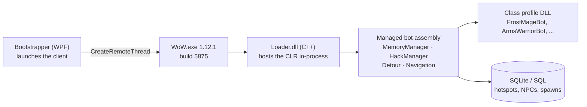

The most important decision I made in the first year was not writing anything.

[BloogBot](https://www.drewkestell.us/Article/6/Chapter/1) already worked. It leveled a character,
fought, looted, and ran back to its corpse. Starting from someone else's working thing meant the
first problem I had to solve was a real one instead of a solved one. My first commit landed
2023-09-20 — *"Basic questing implemented without item use working"* — and two weeks later, on
2023-10-04, I renamed the solution to **RaidLeaderBot**. That rename is the thesis of the next two
years. I did not want a farming bot. I wanted a raid.

Before any of that makes sense, it is worth explaining what a bot of this kind actually is, because
"bot" covers at least three unrelated architectures and only one of them is this.

## Three ways to automate a game client

**Pixel and input automation.** Read the screen, move the mouse, press keys. Requires nothing of the
game, breaks the moment a window moves or a UI scale changes, and cannot see anything the screen
does not show. This is what most people picture, and it is the weakest option.

**Protocol emulation.** Skip the client entirely, speak the server's wire protocol yourself. Scales
enormously — no rendering, no sound, no GPU — but you must reimplement everything the client does,
and any behavior you get wrong is a behavior the server may notice. (This becomes the project's
whole second half. It is a later post.)

**In-process automation.** Load your own code *into the game's address space* and read the client's
own memory. The client has already parsed the protocol, built its object tables, and computed the
world state. You are reading the answers rather than deriving them.

BloogBot is the third kind, and so is every serious bot of the era.

## The injection chain



The sequence is: start the game process, allocate memory inside it, write the path of a native DLL
into that memory, and call `CreateRemoteThread` pointed at `LoadLibrary` with that path as the
argument. The target process loads your DLL as if it had always meant to. That native DLL then
starts the .NET runtime *inside the game process*, which is the part that still strikes me as
slightly absurd — a managed garbage-collected runtime sharing an address space with a 2006 C++
game — and hands control to a managed assembly.

From that moment your C# is running inside `WoW.exe`, with full access to its memory, and can call
the client's own functions.

## Offsets, and why exactly build 5875

Once you are inside the process, the game's state is just bytes at addresses. Finding the right
addresses is the entire game:

```csharp
public static class Offsets
{
    public static class Player
    {
        // Local player class byte, WoW.exe build 5875 VA 0x00C27E81.
        public static nint Class       = 0xC27E81;
        public static nint IsIngame    = 0xB4B424;
        public static nint IsGhost     = 0x835A48;
        public static nint Name        = 0x827D88;
        public static nint TargetGuid  = 0x74E2D8;

        // Corpse world-position globals, VAs 0x00B4E284..0x00B4E28C.
        public static nint CorpsePositionX = 0x00B4E284;
        public static nint CorpsePositionY = 0x00B4E288;
        public static nint CorpsePositionZ = 0x00B4E28C;

        // CMovementInfo base on the player object, build 5875 offset +0x9A8.
        public static int MovementStruct = 0x9A8;
    }
}
```

Two kinds of number live in that table and the distinction matters. `0x00C27E81` is a **virtual
address** — a fixed location in the loaded image, valid because this binary does not use ASLR.
`0x9A8` is a **structure offset** — a displacement from the start of an object, so you read the
player's base pointer and then add `0x9A8` to reach its movement info.

That file is 342 lines of numbers, and every one of them is true only for build **1.12.1 (5875)**.
A different build shifts everything. This is the single hardest constraint in the project and the
reason "just support The Burning Crusade" is not a small feature — it is a second table, obtained
the same painful way the first one was.

It also explains a constraint that propagates absurdly far: the 1.12.1 client is a 32-bit process,
so anything injected into it must be **x86**. Three years later that fact still dictates the
architecture of test projects that never touch the client.

## Reading, writing, and calling

Reading is straightforward once you have addresses. Writing is where it gets interesting, because
the client is a program with invariants, and you are mutating its state from a thread it does not
know about.

Three techniques stack up:

- **Direct memory read/write** for state: health, position, target GUID, whether you are in the
  world, whether you are a ghost.
- **Function calls into the client** for actions that require the game's own logic — the client's
  internal calling conventions include `__thiscall` and `fastcall` variants that C# cannot express
  natively, which is why a tiny native shim exists purely to marshal those calls (and to wrap them
  in structured exception handling, because an incorrect call crashes the game rather than throwing).
- **Lua execution** for things the UI already exposes, since the client embeds a Lua interpreter
  and the entire game interface is written in it. If the UI can do it, you can call the same
  function the UI calls.

There is also the detour mechanism — rewriting the first instructions of a client function to jump
into your code first. That is how you observe events rather than poll for them.

## The behavior layer

Behavior lived in per-class DLLs, one project per spec, twenty-odd of them. `FrostMageBot`,
`ArmsWarriorBot`, `BackstabRogueBot`. Each ran a flat state machine:

```
// The whole bot loop, 2021-style. Pseudocode, but not by much.
while (attached) {
    switch (currentState) {
        case Idle:   if (NearbyHostile(out var t)) Push(new CombatState(t)); break;
        case Combat: RunRotation(); if (TargetDead) Push(new LootState()); break;
        case Rest:   if (HealthPct > 90 && ManaPct > 90) Pop(); break;
        case Dead:   Push(new CorpseRunState()); break;
    }
    Sleep(clientTick);
}
```

Supporting that was a hotspot database: regions annotated with level ranges, patrol waypoints, and
nearby vendor and innkeeper NPCs. The bot picked a hotspot appropriate to its level, ground there,
and moved on when it outgrew it. That is a complete design for a solo leveling bot, and it is worth
saying that it works — this is not a strawman I am about to knock down.

## Where the design ends

Look at the diagram again and notice what is missing: there is no channel between two bots, because
there was never meant to be a second one.

A state machine is a function of one character's local state. That is sufficient right up until the
correct action depends on *another character's* state. A tank that does not know whether the healer
is drinking is not a tank; it is a warrior standing in front of something. A five-person pull
requires that one bot decides when to pull, that four others know a pull has been called, and that
all five agree on the target.

None of that is expressible as `switch (currentState)`. It is not a matter of adding more states,
either — the missing thing is not a state, it is a *channel*, and adding one changes what kind of
system you are building. The next thing I wrote turned a bot into a distributed system, with all
the problems that implies.


