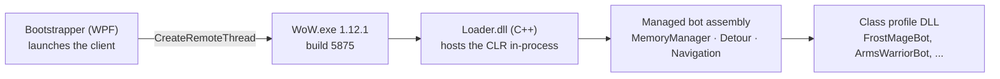

I spent a couple of weeks trying out whatever free WoW bots I could find before it occurred to me
how stupid that was. I had been a software developer for years at that point. Botting a 2006 game
client is not a new problem — people have been doing it for close to two decades — so instead of
downloading another sketchy trial binary, I went looking for source.

I found [Drew Kestell's write-ups](https://www.drewkestell.us/Article/6/Chapter/1). The whole
botting process, laid out article by article, with the source code sitting right there to read.
Most of what he described I already understood in the abstract — memory reading, packet
inspection, that family of technique was not news to me — but seeing it laid out end to end, with a
working codebase attached to every claim, was a different thing entirely. I cloned the repo that
night.

My first commit landed 2023-09-20: *"Basic questing implemented without item use working."* Not
much of a start, and it did not need to be, because BloogBot already worked before I touched it. It
leveled a character, fought, looted, ran back to its corpse when it died. The most important
decision I made in that first stretch was not writing anything — starting from someone else's
working thing meant my first problem was a real one, not a solved one.

The clone kept its history, which is a strange thing to sit with in retrospect. Drew's own commits
are still in there — something like 35 to 46 of them, from 2021-06-07 through mid-2023, under his
own name. My "inheritance" was not a description I copied from a README. It is a git log with two
authors in it, and for the first year the second author was doing almost nothing that the first
author hadn't already made possible.

Two weeks after that first commit, on 2023-10-04, I renamed the solution. The commit message says
*"Refactored solution to better describe projects,"* which undersells it — the project stopped
being called BloogBot and became **RaidLeaderBot**. That rename is the whole thesis of the next two
years, stated before I had any idea how to deliver on it. I did not want a bot that farmed. I wanted
a raid.

## What a bot like this actually is

Before any of that makes sense you need to know what kind of automation BloogBot is, because "bot"
covers at least three unrelated architectures and people conflate them constantly.

There is pixel and input automation — read the screen, move the mouse, press keys. It requires
nothing of the game and sees nothing the game does not choose to render, so it breaks the moment a
window moves. There is protocol emulation — skip the client, speak the server's wire protocol
yourself, which scales enormously but means reimplementing everything the client does for you for
free. That becomes this project's whole second act, much later. And there is in-process automation:
load your own code into the game's address space and read the client's own memory, so you inherit
its parsed protocol, its object tables, its computed world state, for nothing. BloogBot is the
third kind, and so was every serious bot of that era.

Concretely, it looked like this. A WPF Bootstrapper launches `WoW.exe`, then uses
`CreateRemoteThread` to force the process to load a native Loader DLL. The Loader starts the .NET
CLR inside the game process — a managed, garbage-collected runtime sharing an address space with a
2006 C++ game, which still strikes me as slightly absurd — and hands control to a managed BloogBot
assembly. From that point your C# is running inside `WoW.exe` with full read/write access to its
memory and the ability to call the client's own functions.



Everything past that point is addresses. Somewhere in a 342-line table sat entries like a player's
class byte at virtual address `0x00C27E81`, or a movement structure at offset `0x9A8` from the
player's base pointer — one a fixed location in the loaded image, the other a displacement you add
after you've already found the object. Every single one of those numbers is true only for build
**1.12.1 (5875)**, which is also why the client had to be x86: a fact that ended up dictating parts
of this project's architecture years after anything still touched the actual client. Reading state
this way is simple. Writing is not, because you are mutating a program's internals from a thread it
does not know exists, so BloogBot leaned on three techniques — direct memory writes for simple
state, marshaled calls into the client's own functions for anything requiring its internal logic,
and Lua execution for whatever the UI already exposed, since the whole interface is Lua and you can
call what it calls.

Behavior itself lived one level up, in per-class DLLs — `FrostMageBot`, `ArmsWarriorBot`,
`BackstabRogueBot`, twenty-odd of them — each running a flat state machine against a hotspot
database of leveling zones and patrol routes:

```
// The whole bot loop, 2021-style. Pseudocode, but not by much.
while (attached) {
    switch (currentState) {
        case Idle:   if (NearbyHostile(out var t)) Push(new CombatState(t)); break;
        case Combat: RunRotation(); if (TargetDead) Push(new LootState()); break;
        case Rest:   if (HealthPct > 90 && ManaPct > 90) Pop(); break;
        case Dead:   Push(new CorpseRunState()); break;
    }
    Sleep(clientTick);
}
```

That is a complete design for a solo leveling bot, and it worked. It is not a strawman I inherited
so I could knock it down.

## Building RaidLeaderBot

The rename a couple of weeks earlier wasn't a find-and-replace, and it didn't happen by itself.
Jared's first real contribution to the project landed a few days before it: a new controller
process with its own socket server, so the thing launching a character could stay connected to it
afterward instead of firing it off and hoping. A few days after that I added the ability to send a
login command to an already-running instance remotely instead of typing it by hand — a small,
one-line interface change, repeated across every single class-bot file, because "log in" had to
mean the same thing whether a human typed it or the controller did. A `Role` enum showed up in the
models the same day, unused by anything yet. The concept of a character having a role beyond
"whichever class it happens to be" existed in the codebase before there was anything resembling a
raid to assign roles in.

Jared followed that, the same night, by rewriting the controller's UI from a single character
console into an actual collection view — a bindable list, one row per launched instance, instead of
hunting through however many separate windows happened to be open. That's a small, unglamorous
change, and it's the one that actually mattered: the moment you can see five characters in one
list instead of five separate windows, you start thinking about them as a group whether the code
underneath supports that yet or not.

The rename itself, when it landed, was the least dramatic-sounding commit of the bunch by message
and the largest by almost any other measure — north of nine hundred files touched, well over a
hundred thousand lines added. Most of that was mechanical, files sliding into place under new
project names. Not all of it, though: the bot's core picked up a real object model on the way
past — a player class running several hundred lines, a base unit class not far behind it, a proper
memory wrapper — replacing thinner versions that used to live scattered through the old BloogBot
project. The names chosen for the two halves are worth sitting with. The controller became
**RaidLeaderBot**. The thing that used to be BloogBot became **RaidMemberBot**. Leader and Member,
chosen months before "StateManager" and "BotRunner" existed as words, for close to the same split
those two names would eventually formalize. I hadn't planned that split on purpose. I just already
knew, without having a name for it yet, that one part of this was going to give orders and the
other part was going to carry them out.

## Where the design ends

Look at the diagram again and notice what is not in it: there is no channel between two bots,
because the design never assumed there would be a second one. A state machine like that is a
function of one character's own local state, and that holds up fine right until the correct action
depends on *another* character's state. A tank that has no idea whether the healer is drinking is
not a tank, it is a warrior standing in front of something. A five-person pull needs one bot to
decide when to pull, four others to know a pull has been called, and all five to agree on the
target, and none of that is expressible by adding more cases to that switch statement. The missing
piece is not a state. It is a channel, and building one changes what kind of system you are
building.

That is the gap the RaidLeaderBot rename was betting on closing, and it is a difference in kind, not
degree. Leveling a character solo and running a group dungeon are not the same problem at different
sizes; they are different problems that happen to share a character model.

I found that out directly, and not from anything in the commit history — there is no ticket for
this one, it lives only in memory. A group of five bots, ported to GM Island and geared up with GM
commands, went into Ragefire Chasm together. They got in fine.


_Five characters, one raid frame, and a switch statement each — this is what "got in fine" looked
like, right before it stopped looking like that._

They did not get out — stuck under overhangs, wedged into dead-end corners, going nowhere I could
path them back out of. I shelved the project rather than keep chasing it right then. What was
actually wrong with the navmesh, and what it took to even name the problem properly, belongs to
what came after.

