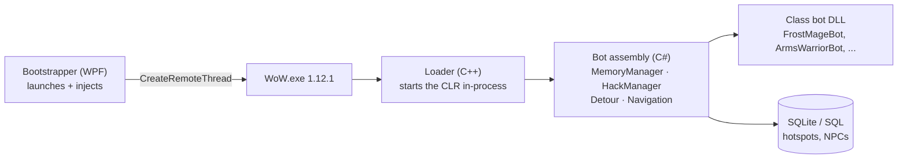

I made all kinds of adjustments and "enhancements" so the bot operated exactly as I expected and
did things that most bots hadn't been configured for. Mainly to group and coordinate with each
other. This is where the solution started to look like my own.

That is the whole first year, and it is worth being honest that the most important decision I made
was not writing anything. [BloogBot](https://www.drewkestell.us/Article/6/Chapter/1) already
worked. It leveled a character, it fought, it looted, it ran back to its corpse. Starting from
someone else's working thing meant the first problem I had to solve was a real one instead of a
solved one.

My first commit landed on 2023-09-20: *"Basic questing implemented without item use working"*.
Two weeks later, on 2023-10-04, I renamed the solution. The commit message is
*"Refactored solution to better describe projects"*, which undersells it — the new name was
**RaidLeaderBot**, and that is the entire thesis of the next two years. I did not want a farming
bot. I wanted a raid.

## What I inherited



A WPF controller launched the game client and injected a native loader. The loader started the .NET
runtime *inside the game process*. From there a C# assembly could read and write the client's
memory directly and detour its functions — which is how you get a bot that plays the actual game
rather than a screen-scraper pretending to.

Behavior lived in per-class DLLs, one project per spec, twenty-odd of them. `FrostMageBot`,
`ArmsWarriorBot`, `BackstabRogueBot`. Each one was a flat state machine.

```
// The whole bot loop, 2021-style. Pseudocode, but not by much.
while (attached) {
    switch (currentState) {
        case Idle:   if (NearbyHostile(out var t)) Push(new CombatState(t)); break;
        case Combat: RunRotation(); if (TargetDead) Push(new LootState()); break;
        case Rest:   if (HealthPct > 90 && ManaPct > 90) Pop(); break;
        case Dead:   Push(new CorpseRunState()); break;
    }
    Sleep(clientTick);
}
```

That design is correct for what it was built to do. One character, one process, one loop, and every
decision it needs to make is answerable from memory it can already read.

## Where it ran out

There is no channel in that diagram between two bots, because there was never meant to be a second
one. Nothing in the architecture is wrong for a solo grinder, and nothing in it helps you at all
once the goal is five characters entering a dungeon together and behaving like a group.

A tank that does not know what the healer is doing is not a tank. It is a warrior standing in front
of something.

Going from "it levels a character" to "it runs a dungeon" is not a matter of adding more states.
It is a different kind of problem, and solving it meant the bots had to start talking to something
outside themselves.
