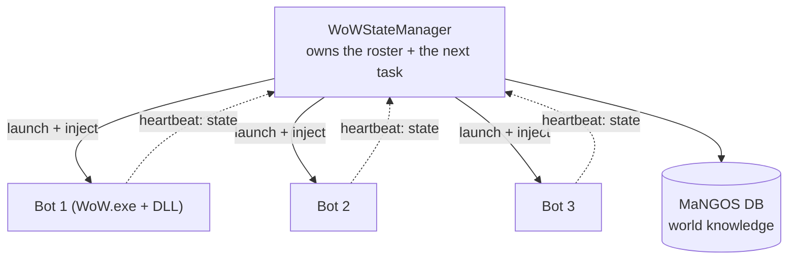

I needed something to manage the state of each bot so it knew what to do next.

I created the first StateManager that was able to launch individual clients (first `WoW.exe`, then
inject the DLL) and use a POC my brother Jared had created that utilized Google protobuf to
compress the messages and create an exchange of information between each individual "bot" and the
StateManager, so each bot knew what to do next. Once a bot was launched, it would have just enough
arguments to know where to reach out to the StateManager and begin a heartbeat communication loop.
As each bot's state changes, the StateManager internal loop will go through and assign the next
task if it requires changing.

## The dates

Jared's contribution landed on 2024-06-23 with the message *"initial commit"*: a C++
ActivityManager, a generated protobuf runtime, and a `communication.proto` twenty lines long. Two
days later, 2024-06-25, *"Refactor to separate roles into different apps"* — the StateManager
exists. On 2024-06-27, *"Working build after refactor"*. On 2024-07-07, *"Working client
launching"*.

By August the tree had `WoWStateManager`, a runner, a UI, `BaseSocketServer`, `MaNGOSDBDomain`,
`StateProfiles`, `ProgressionProfiles`, and the class projects renamed from `FrostMageBot` to
`MageFrost` — a small thing that tells you the profiles had stopped being programs and become data.

## The shape of it



A bot launches with just enough arguments to find the StateManager. It opens a socket and
heartbeats its state. The StateManager's loop walks the roster and assigns the next task to
anything whose state says it needs one. That is the entire coordination model.

It was enough. It did not take long to get 5 bots in a group together and using GM commands to set
themselves up.

## The contract

This is the whole thing, in full, because it is twenty lines:

```protobuf
syntax = "proto3";
package communication;

message DataMessage    { bytes payload = 1; }
message ControlMessage { int32 error_code = 1; string error_description = 2; }

message UniversalMessage {
    oneof message_content {
        DataMessage    data    = 1;
        ControlMessage control = 2;
    }
}
```

An opaque payload, an error channel, and a `oneof` to tell them apart. Today that file and its
siblings come to 5,449 lines across five `.proto` files. Same framing, same idea, two years of
consequences.

## Where it broke

After a few months of working on the project, I found myself stalling, as the bots were successfully
entering Ragefire Chasm but unable to complete it.

There seemed to be little errors with how it handled navmesh generation. The default server method
wasn't the best for units that had to actually adhere to the physics of the game, as opposed to
server-controlled units that didn't — a server-side NPC can be told where it is, and it simply is
there. A client-driven character has to get there, through geometry, obeying the same rules a
player would.

The bots had a knack for getting stuck, and I wasn't making a lot of progress with Detour/Recast in
fixing them getting stuck underneath overhangs or stuck in places that didn't have a path out.

The coordination problem was solved. The problem underneath it was not, and it was not a
coordination problem at all.
