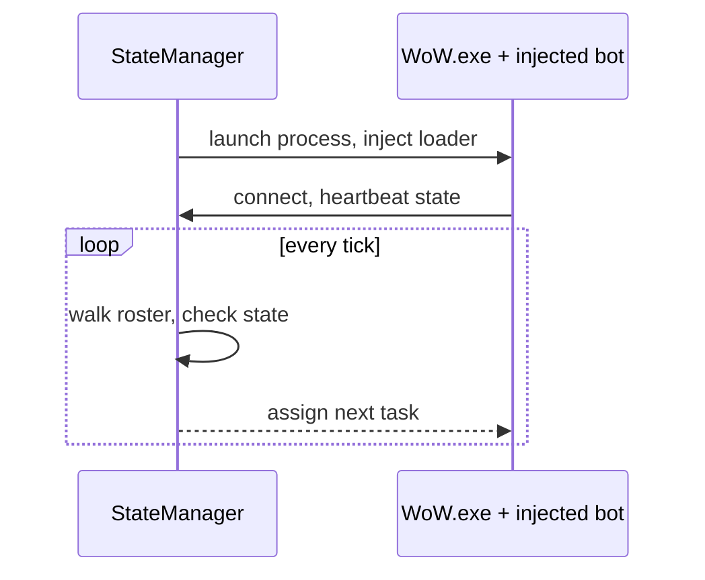

The first time I ran more than one bot at once, both of them walked up to the same wolf. Neither
one knew the other existed. That is the whole problem in one sentence: one bot is a script, and
five bots are a distributed system, and you find that out the moment you try.

BloogBot, as I inherited it, had no concept of a second bot. Every decision a character made — what
to kill, where to walk, when to loot — was made entirely inside that character's own process, with
no way to ask a neighbor what it was doing or tell it to do something else. That is a perfectly
reasonable design for one farming bot. It falls apart the instant the goal changes from "keep this
character busy" to "get five characters into a group together," because now somebody has to decide
who tanks, who waits at the entrance, and who goes first through the door — and that somebody has to
live somewhere none of the five characters do.

## A central hub

The fix started small and stayed small for a while. Nine days after my first commit, the message
is *"Big change to make bots communicate from central hub."* That is the actual birth of
coordination in this project — not a design doc, not a diagram, just a commit message admitting
that bots talking to each other was now the blocker. Progress after that came in the kind of
increments that look unglamorous in a log and felt enormous at the time: basic dungeon crawling
that October, then dungeon pathfinding that actually worked a couple of weeks later. By November
the hub had a name, and clients were launching from it and logging in. Not the StateManager — that
name did not exist yet. It was the ActivityManager, and for the better part of a year that is what
I called the thing that told bots what to do.

It was not stable. A week after clients were launching cleanly, the log reads *"Working
dungeoneering... again"* — and that "again" is doing a lot of work. Something that had
worked stopped working, badly enough that getting it back was its own commit. I don't have a clean
memory of what regressed; what I have is the git record admitting it happened, which is more than I
had before I went looking.

## The name changes, the shape changes

The ActivityManager sat there, mostly working, for months. What actually rebuilt it was not a
decision I made — it was Jared, coming back to the project with a proof of concept for how the
pieces should actually talk to each other. In June 2024 his initial commit lands a C++
ActivityManager, a generated protobuf runtime, and a file called `communication.proto` that was
twenty lines long. Here it is in full, because it is short enough to just show:

```protobuf
syntax = "proto3";
package communication;

message DataMessage    { bytes payload = 1; }
message ControlMessage { int32 error_code = 1; string error_description = 2; }

message UniversalMessage {
    oneof message_content {
        DataMessage    data    = 1;
        ControlMessage control = 2;
    }
}
```

An opaque payload, an error channel, and a `oneof` to tell the two apart. It commits to almost
nothing — it says "two processes will exchange bytes and occasionally report failure" and leaves
every real decision for later, which is exactly right for a first version. You do not know your
message taxonomy on day one, and guessing it into a wire format is worse than leaving it out. That
same file has since grown into something considerably larger, across several files, and I will get
to that in a later post. In June of 2024 it was twenty lines, and that was enough to build on.

Two days after the proto landed, the commit message says *"Refactor to separate roles into
different apps."* That is the sentence where the StateManager is actually born as its own named
thing, separate from whatever runs inside the bot itself — nine months after the ActivityManager
concept first showed up in the log, and under a different name from the one it started with. Two
days after that the split built, and by early July clients were launching again, this time from the
new shape.

## What the StateManager actually does

Strip away the renames and the architecture underneath them is small enough to say in one
paragraph. The StateManager launches a WoW.exe process and injects the bot's loader DLL into it,
passing just enough in the launch arguments for the injected code to find its way back —
an address and a port, nothing more. Once the bot is running, it opens a socket to the StateManager
and starts heartbeating its own state back on a loop. The StateManager's own loop does the other
half of the job: walk the roster, and for any bot whose reported state says it needs a next task,
assign one.



That's the entire coordination model. No scheduler, no priority queue, no negotiation between
bots — just a socket, a heartbeat, and one loop deciding what happens next for whoever needs
something. It is not a clever design. It is barely a design at all, and it was enough: within a few
weeks of the split, five bots were grouping up together and using GM commands to position
themselves, something that had been completely out of reach under the old single-process model.

The rest of that summer is the terms settling into what they still are. By early August the
solution had grown into WoWStateManager, WoWStateManagerRunner, WoWStateManagerUI,
WoWActivityManager, a BaseSocketServer, and a MaNGOSDBDomain project — the ActivityManager name
survived, but only as a role underneath the StateManager, not as the thing running the show.


_The earliest version of that UI, editing a roster literally named RFCBOT1 through RFCBOT10 — the
group that was about to go back into Ragefire Chasm. Underneath class and race sits a set of
Openness/Conscientiousness/Extraversion/Agreeableness/Neuroticism sliders per bot, which is a much
earlier and much smaller-scale version of the "give every character a distinct personality" idea
than anything in this post's architecture — it existed as a config field years before it was
anything the BotRunner actually had to reckon with._

Early August is when both formal terms land in the same commit message: *"Refactored app to
utilize BackgroundServices and moved BotRunner behind interfaces."* The same day, the StateManager
started launching the ActivityManagers itself. That is the StateManager/BotRunner split as it exists
from here forward — the StateManager owns the roster and the tasking, the BotRunner owns whatever a
specific bot does with a task once it has one. Two days later the headless client was launching as
a background service — the first sign that not every bot would need a full WoW.exe window forever. That thread belongs to the next post. I'm not going to pull on it here.

## Ragefire Chasm, again

Five bots grouped, GM-positioned, and coordinating cleanly through a socket and a heartbeat. It felt
like the hard part was over. So we sent them into Ragefire Chasm — the easiest instance in the
game, three floors of imps and a kobold boss, the kind of place you clear half asleep on a
level-twenty character.

They could not finish it. Not because the group logic failed, and not because the StateManager lost
track of anyone. The bots would path into the dungeon and then stop being able to path at all —
wedged under an overhang, standing in a dead-end alcove with no way back out, confidently occupying
a spot that, according to whatever was guiding them, they should not have been able to reach.

The obvious suspect was navmesh generation, and it held up under a little digging. The server's
navmesh had never needed to be exact, because the only things that had ever used it were
server-controlled — creatures the game simply places wherever the server says, without needing them
to actually obey collision. My bots were not that. They were driving a real client through real
geometry, and a mesh that was close enough for a mob that doesn't need to fit through a doorway is
not close enough for one that does.

I didn't have a fix for that yet. I barely had the shape of the problem. What I had, at the end of
that first real attempt at Ragefire Chasm, was the same wall I'd hit before — coordination worked,
grouping worked, GM commands worked, and none of it mattered once the bots tried to actually move
through the dungeon like the game expected them to. The StateManager had solved exactly the problem
it was built to solve. It just turned out that problem was not the one standing between me and a
working raid.

