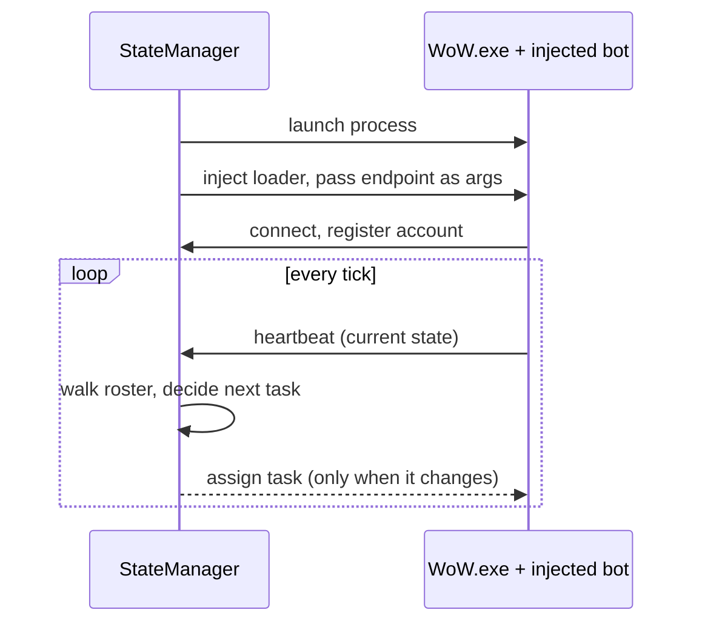

One bot is a script. Five bots is a distributed system, and you find that out immediately.

I needed something to manage the state of each bot so it knew what to do next. My brother Jared had
a proof of concept using Google protobuf to exchange messages between processes, and that became
the foundation. The dates are close together: 2024-06-23, Jared's *"initial commit"* — a C++
ActivityManager, a generated protobuf runtime, and a `communication.proto` twenty lines long.
2024-06-25, *"Refactor to separate roles into different apps"*. 2024-06-27, *"Working build after
refactor"*. 2024-07-07, *"Working client launching"*.

## The original contract

This was the entire inter-process vocabulary:

```protobuf
syntax = "proto3";
package communication;

message DataMessage    { bytes payload = 1; }
message ControlMessage { int32 error_code = 1; string error_description = 2; }

message UniversalMessage {
    oneof message_content {
        DataMessage    data    = 1;
        ControlMessage control = 2;
    }
}
```

An opaque payload, an error channel, and a `oneof` to tell them apart. That is a deliberately empty
design — it says "two processes will exchange bytes and occasionally report failure" and defers
every real decision. For a first version that is correct. You do not know your message taxonomy on
day one, and encoding a guess into a wire format is worse than encoding nothing.

## Framing

Protobuf is a serialization format, not a transport. It does not tell you where one message ends
and the next begins, so you need framing. The frame has grown a little since, and the current shape
is worth showing because every decision in it was forced by something going wrong:

```
+------------------+----------------------+------------------------------+
| Length (4 bytes) | Compression (1 byte) | Payload (N bytes)            |
|   int32, LE      | 0x00 raw, 0x01 gzip  | protobuf, raw or gzipped     |
+------------------+----------------------+------------------------------+
```

The length counts the flag byte plus the payload, not itself, so the wire total is `4 + length`.
Compression is applied only when the raw protobuf exceeds **1024 bytes** *and* only when the result
is actually smaller — gzip on a 200-byte message is a reliable way to make it bigger. A frame is
capped at **16 MiB**, and the same cap is applied to the *decompressed* size, so a gzip bomb cannot
be used to exhaust memory on the receiving side. The decoder also accepts legacy frames with no
flag byte: if the first byte is neither `0x00` nor `0x01`, the whole buffer is treated as raw
protobuf.

That last detail is a small monument to having shipped a format and then changed it.

## The coordination loop



A bot launches knowing just enough to find the StateManager. It connects, then heartbeats its state.
The StateManager's loop walks the roster and assigns a next task to anything whose state says it
needs one. Assignment is edge-triggered — the StateManager only speaks when the answer changes,
which keeps the channel quiet and makes the logs readable.

The socket layer ended up with several server implementations for different pressure: a synchronous
thread-per-connection server, an async pipelined one built on `System.IO.Pipelines` with a 4096
connection backlog, and a reactive streaming variant. Same wire format for all three. The pipelined
one exists because thread-per-connection is fine for five bots and absurd for five hundred.

It worked. It did not take long to get five bots grouped up and positioning themselves with GM
commands.

## And then Ragefire Chasm

After a few months I stalled. The bots entered Ragefire Chasm — a low-level instance, the simplest
dungeon in the game — and could not complete it. They got stuck. Wedged under overhangs. Standing
in places with no path out.

My diagnosis at the time was "something is wrong with navmesh generation", which was correct and
useless. I spent a long time in Recast and Detour trying to fix pathing that was not the problem.

Here is the actual answer, and I did not have it for two years.

A navigation mesh is not a map of the world. It is a map of *where a particular agent can stand*,
baked for a specific agent size. The generator erodes the walkable surface inward by the agent's
radius and discards anything with less headroom than the agent's height. Change the agent
dimensions and you get a completely different mesh from identical geometry.

The stock server-side mesh generator hard-codes continent values of:

```
agentRadius = 0.2
agentHeight = 1.5
```

Those are reasonable for server-controlled creatures, which do not really obey collision — a server
NPC can be told where it is and simply be there. My bots were driving a real client, which does obey
collision. A Tauren male is not 0.2 yards wide:

```
Tauren Male capsule radius : 0.9747
Padding                    : 0.05
Required agent radius      : 1.0247
Tauren Male capsule height : 2.625

Continent Recast cell size : 0.2666666
Continent cell height      : 0.25

walkableRadius = ceil(1.0247 / 0.2666666) = 4   (stock bake: 1)
walkableHeight = ceil(2.625  / 0.25)      = 11  (stock bake: 6)
```

So the mesh was telling my bots they could stand in gaps five times narrower than their bodies, and
walk under ceilings they did not fit through. They pathed confidently into geometry that physically
rejected them, and then sat there — because from the mesh's point of view they were already where
they wanted to be.

Worse, raising `walkableRadius` in the config alone does not fix it. The generated tile header
records the agent dimensions it was built with, and the runtime honors the header. You have to patch
the generator so `agentRadius` and `agentHeight` feed *both* the Recast erosion pass *and* the
Detour tile parameters. Otherwise you get a mesh that was eroded correctly and is then described to
the pathfinder as something else.

## The lesson I did not learn yet

There is a rule buried in this that took much longer to surface: **repairing a bad bake at runtime
is an anti-pattern.** If a route only works because the pathfinding service patched the returned
path after the query, the underlying data is still wrong and you have converted a reproducible bug
into an unreproducible one. Fix the generator, the source geometry, or the off-mesh connections.

I did not know any of that in 2024. What I knew was that the coordination problem was solved and the
thing underneath it was not, and that the thing underneath it was not a coordination problem at all.
It was geometry, and behind the geometry was physics, and I had not started on physics.


