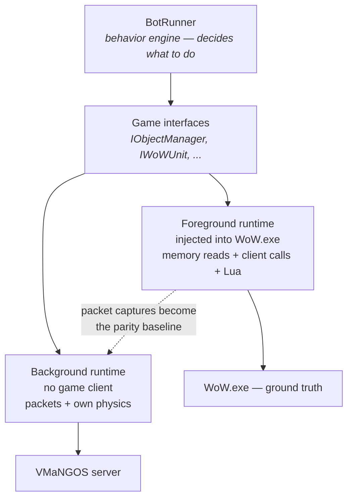

After a series of discussions with Jared about where LLMs were going, we landed on the idea the
project is named after: a server populated by bots, each simulating a character with its own
personality, human enough that a real player could not tell whether anyone was at the keyboard.

That goal has an immediate and unglamorous consequence. Populating a world means thousands of
characters, and you cannot run thousands of copies of a 2006 game client. Each one wants a window,
a GPU context, audio, and something like a gigabyte of memory. The math fails long before the
interesting part starts.

So the bot had to stop being a passenger inside the client and become a client.

## What the client actually does for you

Injection gets you the client's *answers*. Remove the client and you inherit all of its
responsibilities:

1. Authenticate against the login server.
2. Pick a realm, connect to the world server, establish an encrypted session.
3. Parse a continuous stream of opcodes.
4. Maintain an object manager — every unit, player, item, corpse and game object in range, with
   all of their fields.
5. Simulate movement and collision well enough that the server believes you.
6. Answer spatial questions: what is in front of me, can I reach it, am I close enough to interact.

Items 1 through 4 are work. Item 5 is two years of this blog. Item 6 turns out to depend on 5.

## Authentication

The login server speaks a small binary protocol on **TCP 3724** with no encryption, using **SRP6**
— Secure Remote Password — so the password itself never crosses the wire and the server never
stores it:

```
C → S   CMD_AUTH_LOGON_CHALLENGE (0x00)   username, build, platform
S → C   challenge response                B, salt, generator, modulus
C → S   CMD_AUTH_LOGON_PROOF (0x01)       A, M1
S → C   proof response                    M2
C → S   CMD_REALM_LIST (0x10)
S → C   realm list
```

Both sides derive a shared **session key** from the exchange, and the client proves knowledge of the
password by computing `M1`; the server proves it too, with `M2`. The session key then encrypts the
world connection's packet headers.

The build number is submitted in the very first packet, and the server rejects anything it does not
recognise with `WOW_FAIL_VERSION_INVALID` (`0x09`). The headless client writes **5875** there, which
is the same hard commitment to 1.12.1 that the offset table represents on the injected side — just
in a different form.

## Object updates, which are the actual work

The world server's most important message is `SMSG_UPDATE_OBJECT` (`0xA9`), or its zlib-compressed
sibling `SMSG_COMPRESSED_UPDATE_OBJECT` (`0x1F6`). One packet carries a count followed by that many
update blocks:

| Value | Type | Meaning |
|---|---|---|
| 0 | `UPDATETYPE_VALUES` | Field values changed |
| 1 | `UPDATETYPE_MOVEMENT` | Position/movement only |
| 2 | `UPDATETYPE_CREATE_OBJECT` | Object created |
| 3 | `UPDATETYPE_CREATE_OBJECT2` | Object created (self) |
| 4 | `UPDATETYPE_OUT_OF_RANGE_OBJECTS` | Leaving visibility |
| 5 | `UPDATETYPE_NEAR_OBJECTS` | Entering visibility |

Each object has a descriptor array whose size depends on its type — and the sizes are not small:

| Type | Descriptor fields |
|---|---|
| `TYPEID_ITEM` | 48 |
| `TYPEID_CONTAINER` | 116 |
| `TYPEID_UNIT` | 188 |
| `TYPEID_PLAYER` | **1,276** |
| `TYPEID_GAMEOBJECT` | 32 |
| `TYPEID_CORPSE` | 38 |

A values update does not send all 1,276 fields. It sends a bitmask of which indices changed,
followed by only those values, and you apply them to your local copy. Which means: **you cannot
recover from a missed packet.** There is no full-state resync. If you mis-parse one update block,
your view of the world silently diverges from the server's and stays diverged. Every bug in this
layer is a bug that shows up ten minutes later as inexplicable behavior.

This is the part where "the client has already done this for you" stops sounding like a convenience
and starts sounding like a decade of work you are re-doing.

## The commit that mattered

On 2024-08-07 I committed *"Refactored app to utilize BackgroundServices and moved BotRunner behind
interfaces"*. That message undersells itself. Putting the behavior engine behind an interface is the
architectural decision the entire project now rests on:



One brain, two bodies. Everything the bot *decides* sits above the interface and has no idea which
runtime it is attached to. Below it, either a real client driven through process memory or a headless
client driven through packets.

You need both, and the reason is epistemic rather than practical. The foreground runtime is the real
game: whatever it does is correct by definition. The background runtime is the one that scales.
Captures from the first are the specification the second must satisfy — which is the only way to
answer "is my reimplementation right?" without guessing.

The project timeline follows: 2024-07-16, *"Working headless client POC"*, then called
**WoWSlimClient**. A day later it was modular. Two days after that, clients, object management, and
event notification were separated. By 2025-05-17, *"Working character creation"* — the headless
client could create its own characters rather than borrowing existing ones.

## Talking to it

On 2024-08-16: *"Working Ollama integration with chat"*.

Chat is a pleasant subsystem to implement because it is genuinely simple — an opcode with a message
type, a language id, and a string. I wired incoming chat to a locally running Ollama instance and
piped the response back out.

The result was a character standing in the world, with no game client involved anywhere, holding a
conversation. It is the first time the project felt like the thing it was named after rather than an
automation tool. It also set a boundary I have kept since: the model writes **words**, never
actions. Nothing an LLM produces is allowed to decide what a character does. That constraint is
about reproducibility more than safety — a system whose decisions come from a sampled distribution
cannot be regression tested, and this project lives or dies on being able to tell whether a change
made things better.

## The wall

Then I started on movement, and stopped for two years.

I knew very little about 3D engines and had only dabbled in Unreal and Unity. I tried adapting
open-source collision code and what I implemented was clearly not compatible with Blizzard's
geometry — the results varied, which is the worst possible outcome because it looks like a tuning
problem. I kept testing by having the background client use the navmesh to decide what height to
stand at, which works on open ground and fails everywhere that matters.

A navmesh tells you where a character *may* stand. It does not tell you how one falls, how far it
slides off a ledge, whether a step is climbable, or whether the thing in front of it is close enough
to talk to. Those are physics questions, and I did not have physics.


