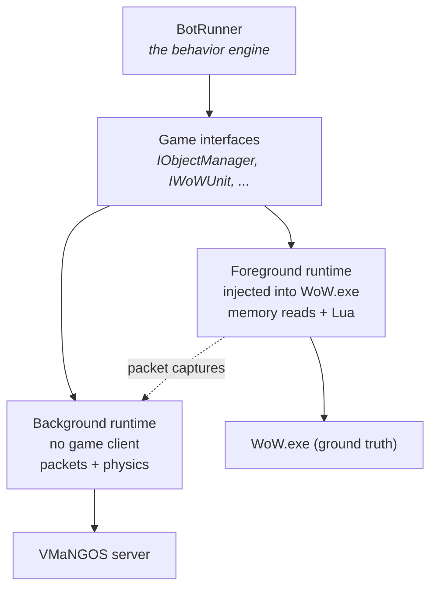

After a series of discussions with my brother about the future of LLMs, we quickly came upon our
final idea: Westworld of Warcraft. A WoW server populated by bots, where each bot would simulate a
unique character with its own personality and could operate and be so human-like that a real human
playing with them would not be able to discern if someone was on the other end of the keyboard, or
if there was a keyboard at all.

The major hurdle to overcome at this point was scaling. We would never just be able to launch
3,000+ clients and have them be able to operate as we needed them to for our simulation. We would
need a lightweight client that could authenticate and exchange packets as well as follow the
navmesh — a client that would use far less resources and still be able to operate a character.

## Standing it up

It didn't take too long standing up scaffolding that would use pre-existing libraries that could
handle the session-key generation as well as send the correct packets. At this point I am taking
server emulation code and putting it into ChatGPT so it can give me files to work with. There was a
lot of "uploading project documents/code files", then "generate new code attempt", and using that
to see what worked and repeating the process — but this time with output logs.

This was enough to get a character logged in outside of the official client and facing my character
that was logged in normally.

The commit is dated 2024-07-16 and reads *"Working headless client POC"*. The project was called
**WoWSlimClient**. A day later it was modular; two days after that, clients, object management and
event notifications were separated.

Then, on 2024-08-16: *"Working Ollama integration with chat"*. I quickly piped in the chat packets
to be used with my locally running Ollama instance and was able to "communicate" with my Background
Bot character. There is no client involved in that sentence anywhere. A thing that was not a game
was standing in the game, talking back.

## The commit that mattered

On 2024-08-07 I committed *"Refactored app to utilize BackgroundServices and moved BotRunner behind
interfaces"*. That message is doing a lot of quiet work. Putting the behavior engine behind an
interface is what made the next two years possible:

One brain, two bodies. Everything the bot *decides* lives above the interface. Below it, either a
real client driven through process memory, or a headless client driven through packets. The
foreground runtime is ground truth — it is the actual game, so whatever it does is by definition
correct. The background runtime is scale. Captures from the first are the baseline the second has
to reproduce.

You need both. One of them tells you what right looks like and costs you a gigabyte of RAM and a
GPU. The other one you can run a thousand of.

## The wall

I was writing a lot of code manually from here and, as I started working on movement, I hit my
first real wall.

I knew very little about 3D engines and had only dabbled with engines like Unreal and Unity. I tried
using open-source code but what I implemented was clearly not compatible with the Blizzard geometry,
and the results varied. I was able to continue testing by having the background client use the
navmesh for what height to stand at, but that was still limited and didn't provide the desired
results, as simple as the solution sounded.

A navmesh tells you where a character may stand. It does not tell you how a character falls, what
happens when it walks off a ledge, how far it slides, or whether the thing in front of it is close
enough to talk to.
