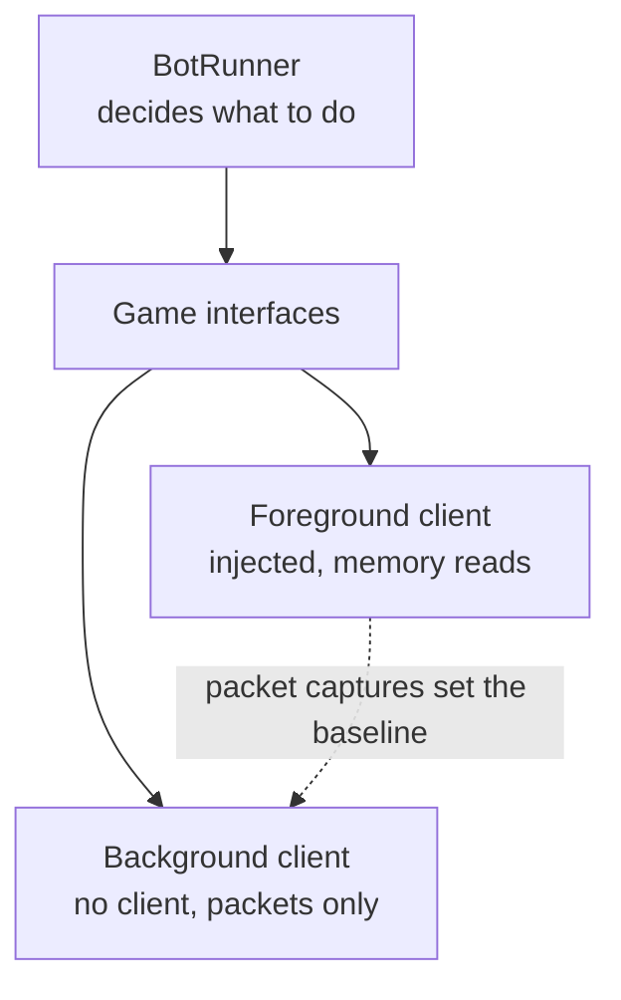

The idea came up in conversation with Jared, the way most of the good ones did: a server
populated by bots, each one simulating a character with its own personality, human enough that
a real player logged in next to it couldn't tell whether anyone was at the keyboard. We liked it
immediately and then, about thirty seconds later, ran into the part where it doesn't work.
Populating a world means thousands of characters. You cannot launch 3,000 copies of a game
from 2006. Each one wants a window, a GPU context, audio, something like a gigabyte of memory, and the
math fails long before you get anywhere near the interesting problem.

_Two eighty-bot raids at once, each one a real foreground client, and 64 GB already gone before
either group finished forming up. This is the ceiling the math above is describing, not an
exaggeration of it._

The answer we landed on was a lightweight client — something that could authenticate, exchange
packets, and follow a navmesh, without any of the overhead of actually being WoW.exe.

## What the client has to do

Injection gets you the client's answers for free. Take the client away and you inherit its job:
log into the auth server, negotiate a session key, connect to the world, and parse a continuous
stream of opcodes into something resembling a coherent world — every unit, item, and object in
range, with fields that update in place rather than arriving whole. Miss one update and there is
no resync; your copy of the world just quietly diverges from the server's and stays that way. Then,
on top of that, you have to move the thing convincingly and know when it's close enough to
interact with something. That last part turned out to be the expensive one, but it took a while to
find that out.

None of it is glamorous, and none of it looks like the actual point of the project. It's a decade
of client engineering you're redoing so that the interesting part — a bot that behaves like a
person — has a body cheap enough to run three thousand of.

## The other half of that commit

The project log shows the shape of this coming together in real time. In mid-July 2024 the first
headless client worked as a proof of concept, a project I named WoWSlimClient. The next two days were spent making it
modular — clients, object management, and event notifications pulled apart into their own pieces
before the thing had done anything useful yet, which in hindsight is just how I work.

Then, in early August, I committed "Refactored app to utilize BackgroundServices and moved BotRunner
behind interfaces." If that line looks familiar, it's because the last post described the other
half of the same day's work — the StateManager and BotRunner naming split happened here too. What
I didn't dwell on there is what "behind interfaces" actually bought: the behavior engine, the part
of a bot that decides what to do, no longer has any idea what it's driving. Above the interface,
one brain. Below it, two possible bodies.

Two days later the headless client was running as a BackgroundService, and
WoWSharpClient shows up in the log — the name it still goes by. The foreground runtime stayed
ground truth, because it's the real game and whatever it does is correct by definition. The
background runtime was the one built for scale, and everything it did had to be checked against
packet captures taken from the foreground side, since that was the only way to know whether a
reimplementation was actually right rather than just plausible.

_This is what checking the background runtime against the foreground one actually looked like in
practice — the same small, repeatable action running on both, side by side, so any divergence
between them had nowhere to hide._

Character creation followed almost a year later — the headless client could finally make its own
characters instead of borrowing ones I'd made by hand. A couple of weeks after that, the whole thing
got rearranged into the Exports and Services layout still in use today, which is a less interesting
sentence than the work it represents.

## Talking to it

A week after the headless client became a service, the log says "Working Ollama integration with
chat," which undersells what that
afternoon actually felt like. Chat is a simple subsystem as WoW protocol goes — an opcode, a
message type, a string — so wiring it to a locally running Ollama instance wasn't much code. I
piped incoming chat packets into the model and sent whatever came back out the other side as a
whisper.

Then I logged in with my real character and said something to it.

There was no client rendering the thing that answered me. No window, no character model loading
in, nothing but a name standing in the world and a response coming back that made sense in
context. It's the first time in the whole project that it felt like the thing it was named after,
rather than an automation tool with a good elevator pitch. I've kept one rule since that afternoon:
the model writes words, never actions. Nothing an LLM produces gets to decide what a character
does, mostly because a system whose behavior comes from a sampled distribution can't be regression
tested, and this project only survives if I can tell whether a change made something better or
worse.

Movement was next, and it's where I stalled for two years. Open-source collision code didn't agree
with Blizzard's geometry, and the failures didn't look like a bad implementation — they looked
like a tuning problem, which is worse, because it invites you to keep tuning. The stopgap was
having the background client ask the navmesh what height to stand at instead of solving collision
properly, and that held up right up until it didn't: a navmesh tells you where a character may
stand, not how it falls, how far it slides, or whether the ledge in front of it is climbable. Those
are physics questions, and I didn't have physics yet. Which meant, eventually, physics had to
actually work.

