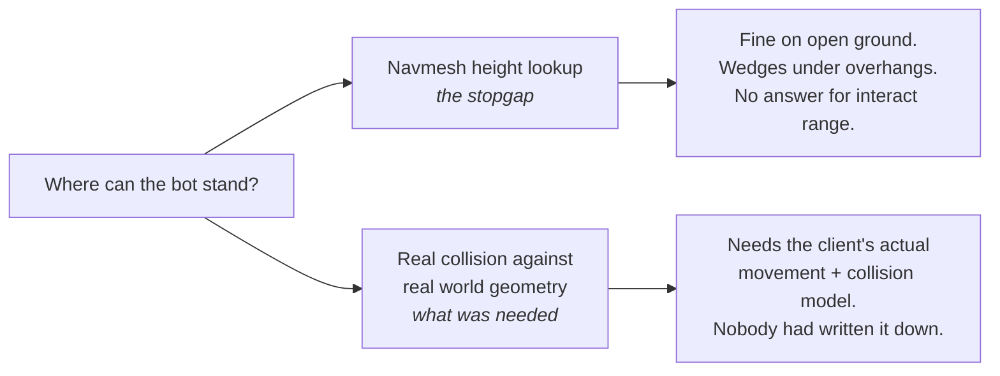

This meant I HAD to get the physics working.

Collision and physics were going to be calculated in the background client so it could operate like
the original client as far as traversing terrain, but also with behavior-relevant information like
how large the interact distance is for a particular unit or game object. So this meant that even if
we had all of these things in place, we would still need to scale the game assets so that each
background client could get the necessary data it needed to make decisions without needing to
display anything or play any sounds.

That last part is easy to skim past. Every headless bot needs enough of the world to answer
questions about the world — not to draw it, just to reason about it. Where the floor is. What is
solid. Whether that door is open. How far away that vendor is, in the units the server will agree
with.

## Two ways to answer "where can the bot stand"

The stopgap worked well enough to keep testing, which is exactly what made it dangerous. A bot that
walks across a field correctly looks like a bot that works. The failures were all in the places
that mattered: indoors, under things, on slopes, near ledges — which is to say, in dungeons.

## It was not for lack of trying

The record does not show an abandoned effort. It shows a long one:

- 2026-02-03 — a physics documentation tree started.
- 2026-02-09 — *"Fix physics engine precision: air snap margin + swim backward speed"*.
- 2026-02-15 — *"Cpp physics system (#62)"*, merged off a `cpp_physics_system` branch.

Months of calibration. Air snap margins, swim speeds, ground snapping, precision fixes. Every one
of those commits is a real improvement and none of them solved it.

Here is the shape of the problem, and it took me a long time to say it this plainly: **every fix was
a guess checked against a symptom.** I could tell when the bot was wrong — it fell through the
world, or it hovered, or it stuck. I could not tell what right was. There was no reference to
compare against, only behavior to compare against, and behavior only tells you that you are wrong,
never how.

As I'm struggling to implement all of this, Claude and Codex are emerging. I'm still utilizing
Copilot and ChatGPT to implement what I can, but there is still a lot of limitation with what it
could generate at the time and, as this was one of many hobbies (albeit the one I spent the most
time on), I still had other things I wanted to do and I was starting to lose hope that I would make
any progress again.

I decided to shelve it for a while and come back to it.
