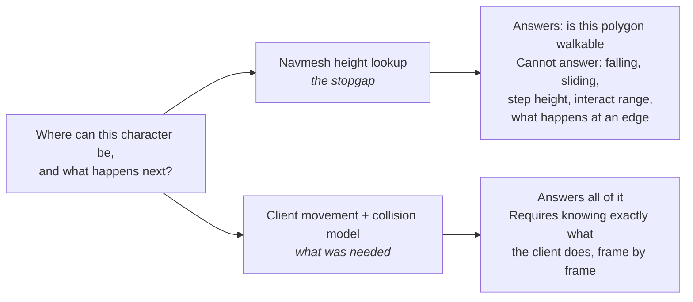

This meant I HAD to get the physics working.

I want to spend a whole post on why, because from outside it looks like the easy part. The bot
already knew where it was and where it wanted to be. There was a navmesh. Surely movement is
interpolation.

It is not, and the reason is a design decision Blizzard made twenty years ago.

## Movement is client-authoritative

In WoW 1.12.1, **the client decides where it is.** It computes its own position each frame and
reports it; the server validates loosely and rebroadcasts to everyone nearby. There is no
server-side simulation producing the authoritative answer that the client then displays.

The practical consequence for a headless client is severe: *there is nobody to ask.* If I emulate a
client and my movement model is wrong, the server does not correct me. It believes me, up to its
sanity checks, and my character is simply somewhere a real client would never have put it.

Every movement packet carries a full `MovementInfo`: flags, a timestamp, position and orientation,
transport data when riding something, swim pitch, fall time, and jump parameters. The flags field is
a 32-bit mask with 33 defined values, including:

| Flag | Value | Meaning |
|---|---|---|
| `MOVEFLAG_FORWARD` | `0x00000001` | Moving forward |
| `MOVEFLAG_WALK_MODE` | `0x00000100` | Walking rather than running |
| `MOVEFLAG_ROOT` | `0x00001000` | Rooted in place |
| `MOVEFLAG_JUMPING` | `0x00002000` | In a jump arc — adds four jump floats |
| `MOVEFLAG_FALLINGFAR` | `0x00004000` | Falling from height |
| `MOVEFLAG_SWIMMING` | `0x00200000` | In water |
| `MOVEFLAG_SPLINE_ENABLED` | `0x00400000` | Server-driven spline movement |
| `MOVEFLAG_ONTRANSPORT` | `0x02000000` | On a ship or zeppelin |
| `MOVEFLAG_SAFE_FALL` | `0x20000000` | Slow Fall / Levitate active |

These are not decorative. The packet's *layout changes* based on them — set `MOVEFLAG_JUMPING` and
four additional floats appear in the body; set `MOVEFLAG_ONTRANSPORT` and a transport block appears.
Parsing or emitting one incorrectly desynchronises the stream rather than producing a wrong value.

There are also combinations that are invalid rather than merely unusual. Setting any of the moving
flags together with `MOVEFLAG_ROOT` causes the real client to stop dead. Reproducing a protocol
means reproducing its illegal states too.

## What the navmesh cannot answer

Using the navmesh as a height source is a fine stopgap and a bad foundation. It answers one
question — *is this surface walkable* — and every failure I had was a different question:

- **Falling.** Walk off a ledge and a real character accelerates under gravity, accumulates fall
  time, possibly takes damage, and lands somewhere determined by that arc. A navmesh lookup
  teleports you to the floor height.
- **Step height.** Whether a character walks up a ledge or is stopped by it is a threshold in the
  movement code, not a property of the mesh.
- **Interact distance.** Whether you can talk to a vendor, loot a corpse, or open a door is a
  distance check the server also performs. Get your position subtly wrong and interactions fail for
  no visible reason.
- **Water.** Swimming has its own speeds, its own jump impulse, and its own flags.

That last category is what made this unavoidable. Collision had to be computed in the background
client not only so bots could traverse terrain, but so they could answer *behavior-relevant*
questions — how large the interact distance is for a particular unit or game object. Behavior
depends on physics. You cannot defer it.

## And the data problem behind the data problem

Even with a correct model there is a second issue: every headless bot needs enough of the world to
answer spatial queries. Not to draw it — to reason about it. Where the floor is, what is solid,
whether that door is currently open.

So the world's collision geometry has to be extracted, baked into a compact form, and served to
potentially hundreds of processes that have no renderer and never load a texture or play a sound.
That is a whole subsystem, and it only pays off if the physics consuming it is correct.

## Guessing against symptoms

The record does not show an abandoned effort. It shows a long, patient, wrong one:

- 2026-02-03 — a physics documentation tree begins.
- 2026-02-09 — *"Fix physics engine precision: air snap margin + swim backward speed"*.
- 2026-02-15 — *"Cpp physics system (#62)"*, merged from a dedicated branch.

Air snap margins. Swim speeds. Ground snapping tolerances. Every one of those commits is a real
improvement and none of them solved anything, because of a problem I could not articulate at the
time:

**Every fix was a guess checked against a symptom.** I could tell when the bot was wrong — it fell
through the world, hovered, stuck, or drifted. I could not tell what *right* was. There was no
reference implementation to compare against, only observed behavior, and observed behavior tells you
that you are wrong without ever telling you how.

Tuning a constant until the symptom goes away produces a system that is wrong in a new place
instead. I did that for a long time.

As I was struggling with this, Claude and Codex were emerging. I was still using Copilot and ChatGPT
for what they could do, but there were real limits on what could be generated at the time, and this
was one of several hobbies — the one I spent the most time on, but still one of several. I was
starting to lose hope that I would make progress again.

I shelved it.


