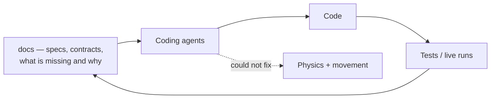

By this point, I have a solution that contains multiple projects all covering various aspects of
the Westworld of Warcraft goal. Most are "spec'ed out", where every aspect of what the codebase did
was documented, and what was missing or expected to be implemented. I'm finding myself wanting to
do other activities as I feel like I'm spinning my wheels with countless attempts to isolate the
collision and physics.

All that would change when my brother would message me and tell me he had tried the new "Claude
Code" and that it would be able to get me past my next hurdle.

## What happened to the commit rate

| Period | Commits per month |
| --- | --- |
| 2024 average | ~7 |
| 2025 average | ~20 |
| Feb 2026 | 80 |
| Mar 2026 | **833** |
| Jul 2026 | **2,203** |

The February commits have the texture you would expect from a project being taken apart and put
back together: *"Claude overhaul WIP"*, *"The mother of all merge commits"*, *"Completely merged."*,
*"Mess of a WIP"*. Around them, a wave of agent branches — Semantic Kernel evaluation, Serilog
snapshot logging, safety in the PvE rotation classes, a BotProfiles base-class refactor, an entire
WPF-to-Blazor rewrite of the operator console.

## Why it took

The part worth writing down is not that the agents were fast. It is *why* they had anything to
work with.

The project was already spec'ed out. I had written all that documentation for me — to remember what
a subsystem was for after three months away, to keep track of what was missing. It turned out that
documentation describing what the code does, what it does not do yet, and what the constraints are,
is exactly the interface a coding agent needs. I had accidentally spent two years building the
input format.

## And the wall did not move

I started using it and knew it was good, but even after countless upgrades and refactors, I still
wasn't able to get past the physics/collision/movement controls problem I had been encountering.
Claude along with Codex were working wonders on the repo, but any time I turned my attention to
fixing movement, it would still stall. No amount of frame-by-frame analysis was cracking the code.

Both halves of that matter, and the second half is the one people tend to leave out. Throughput
went up by two orders of magnitude and the actual blocker was completely unmoved. Faster iteration
on a guess is still a guess. I had more capacity to try things and exactly as much information
about what right looked like, which was none.

What broke it loose was not a better model. It was realising I had been asking the wrong question
for two years.
