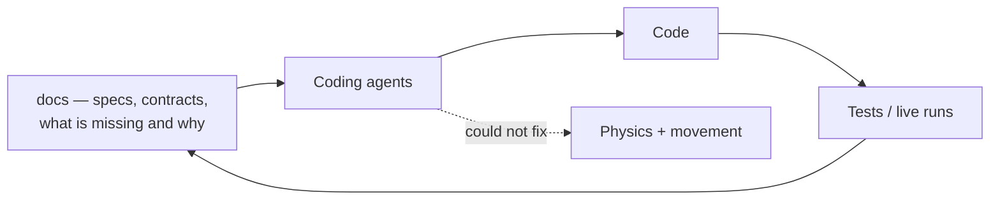

By early 2026 the solution had grown into a lot of projects covering various parts of the Westworld
of Warcraft goal, and most of them were spec'ed out — every aspect of what the codebase did was
documented, along with what was missing and what was expected to be implemented. I had written all
of that for myself, to remember what a subsystem was for after three months away.

Then Jared messaged me to say he had tried the new Claude Code and that it would get me past my next
hurdle.

## The number

| Period | Commits per month |
| --- | --- |
| 2024 average | ~7 |
| 2025 average | ~20 |
| Feb 2026 | 80 |
| Mar 2026 | **833** |
| Jul 2026 | **2,203** |

The February commits have the texture of a codebase being taken apart and put back together:
*"Claude overhaul WIP"*, *"The mother of all merge commits"*, *"Completely merged."*, *"Mess of a
WIP"*. Around them, a wave of branches doing work I had wanted for years and never scheduled — a
Semantic Kernel evaluation, Serilog snapshot logging, safety passes over the PvE rotation classes, a
base-class refactor across all the class profiles, and a full rewrite of the operator console from
WPF to Blazor.

## Why it took, which is the transferable part

The interesting claim is not that the agents were fast. It is *why they had anything to work with*,
and I got there by accident.

Documentation written to remind yourself what a subsystem does, what it does not do yet, and what
constraints it operates under, is very close to the ideal input format for a coding agent. I had
spent two years unintentionally building it.

What made the difference was not prose quality. It was that the docs recorded **decisions and
constraints**, not just descriptions. A description tells an agent what the code does, which it can
read anyway. A constraint tells it what it must not break, which it cannot infer.

Here is my favourite example, because it is so arbitrary that nobody would ever guess it:

> `Tests/WoWSharpClient.Tests` must build **AnyCPU** and must not be x86.
> `Tests/BotRunner.Tests` must build **x86**, and legitimately so.

The reason traces all the way back to the first post: the 1.12.1 client is a 32-bit process, so
anything that touches injection must be x86 — and BotRunner's test suite exercises that path. The
pure protocol suite has no such constraint and suffers from the restriction.

The consequence of getting it wrong is not a compile error. One run executed 2,694 tests with 145
failures; the same suite built the other way executed **7 tests and aborted**. A suite that aborts
after 7 tests can easily read as "mostly passing" if you are skimming, and an agent optimising for a
green build will happily make that trade.

That is the kind of fact that has to be written down, because no amount of reading the source
recovers it.

## What the agents were good and bad at

Good, immediately: mechanical refactors across many files, protocol table transcription from an
emulator's source, test scaffolding, the tedious middle of a migration, and anything where the
target was specified precisely and the work was volume.

Bad, persistently: anything requiring a ground truth I did not have. Which was the problem I
actually needed solved.

## The wall did not move

I started using it and knew it was good, but even after countless upgrades and refactors I still
could not get past the physics, collision and movement controls problem. Claude and Codex were
working wonders on the repo, and any time I turned my attention to movement it would still stall. No
amount of frame-by-frame analysis was cracking it.

Both halves of that sentence matter, and the second half tends to get left out of stories like this
one. Throughput went up roughly a hundredfold and the actual blocker was completely untouched.

The reason is the one from the previous post. I could generate candidate implementations far faster
than before, and I still had no way to tell whether any of them was *right* — only whether the
symptom had moved. Faster iteration against an unreliable oracle does not converge. It just explores
the wrong space more thoroughly.

What broke it loose was not a better model. It was noticing that I had been asking the wrong
question for two years, and that the answer had been sitting on disk the entire time.


