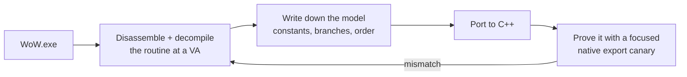

The old bots were built by decompiling the engine and reading memory values. So why not have the
agent dump the `WoW.exe` binary and reverse-engineer it?

I want to be clear that this is not a clever idea. Reverse engineering the client is how this entire
field has always worked — it is where every offset in every bot I have ever used came from. What
changed was not the technique. What changed was that the tedious part, the part that made it a
specialist's job measured in months, became something I could delegate.

The previous two years had a specific shape: I had no ground truth, so I tuned constants against
symptoms. The binary *is* the ground truth. It had been sitting on my disk the whole time.

## Two years, then forty-eight hours

| Date | Commit |
| --- | --- |
| 2026-03-21 | Decompile WoW.exe physics, update constants to exact binary values |
| 2026-03-22 | Decompile WoW.exe collision sweep: AABB 2-pass at 0x633840 |
| 2026-03-22 | Decompile WoW.exe spatial collision grid and contact system |
| 2026-03-22 | Decompile WoW.exe packet send pipeline and movement dispatch |
| 2026-03-22 | Document complete MovementInfo wire format from WoW.exe decompilation |

## The negative result, first

`WoW.exe` is **not** a PhysX-style three-pass swept-capsule character controller.

That sentence saved more time than anything else in this project. Every open-source movement
implementation I had tried to adapt assumed something in that family, because that is what a modern
engine does and what the available code is written for. It explains why my results *varied* rather
than being consistently wrong: I was not implementing a slightly incorrect version of the client's
model, I was implementing a different model and tuning it until the symptoms quietened down.

What is actually in there is older and simpler:

- a **closed-form movement state machine** handling commands, speed, gravity, jump, fall and swim;
- a **two-pass swept-AABB collision step** — an axis-aligned box, not a capsule;
- a **grounded driver that selects a single contact** and resolves against it, rather than
  accumulating several.

Nobody would write it this way today, which is exactly why guessing failed.

## Constants, and why the exact bits matter

```cpp
// WoW.exe 1.12.1 VA 0x0081DA58: 19.29110527 (0x419A542F as IEEE-754)
constexpr float GRAVITY = 19.29110527f;

// The client precomputes its own multiples and stores them as globals.
// Port these too, or you accumulate error the client never has.
constexpr float HALF_GRAVITY   = GRAVITY * 0.5f;  // VA 0x0081DA60
constexpr float DOUBLE_GRAVITY = GRAVITY * 2.0f;  // VA 0x0081DA64
constexpr float INV_GRAVITY    = 1.0f / GRAVITY;  // VA 0x0080E020

// Jump impulse is an immediate in the instruction stream, not a named global.
// 0x7C626F: 0xC0FE93D8 = -7.955547f  (negative because up is negative here)
// Implied max jump height: v² / 2g = 1.640 yards.
constexpr float JUMP_VELOCITY           = 7.955547f;
constexpr float JUMP_VELOCITY_SWIMMING  = 9.096748f;   // 0x7C6266

// NOT a hardcoded constant. Computed at init by SetTerminalVelocity (0x7C6160):
//   termVel = param * STEP_HEIGHT_FACTOR(1.0936), default param ≈ 55.0
constexpr float TERMINAL_VELOCITY            = 60.14800262f;  // VA 0x0087D894
constexpr float SAFE_FALL_TERMINAL_VELOCITY  = 7.0f;          // MOVEFLAG_SAFE_FALL

// Base speeds, yards/second. Walk and Run confirmed at 0x0081018C / 0x00810190.
constexpr float BASE_WALK_SPEED     = 2.5f;
constexpr float BASE_RUN_SPEED      = 7.0f;
constexpr float BASE_RUN_BACK_SPEED = 4.5f;
constexpr float BASE_TURN_RATE      = 3.141594f;  // pi rad/s
```

`19.5` versus `19.29110527` is meaningless over one frame. Over a two-second fall it is the
difference between landing where the server thinks you landed and being somewhere else — and
"somewhere else" is how a character ends up under the floor.

The precomputed multiples are the detail I would never have found by reasoning. The client does not
divide by gravity at runtime; it stores `1/GRAVITY` and multiplies. Implement it the obvious way and
you drift slowly, in a pattern that looks like a logic bug rather than an arithmetic one.

`TERMINAL_VELOCITY` is the best example of why decompilation beats inference. It is not a literal in
the binary at all — it is computed at startup as `55.0 × 1.0936`. You can observe the resulting
number forever without ever learning that it has *factors*, and without knowing the factors you
cannot tell which one changes when something modifies fall behavior.

The fall damage constants have a similar shape. The binary stores `10.0` and `11.111111` (which is
`100/9`), and then two init functions at `0x7C7BD0` and `0x7C7C00` *square* them and store the
results as separate globals — `100` and roughly `123.457`. If you find only the squared globals you
will never guess what they are.

## The collision model

Once the constants were right, the geometry work followed the same method. The physics engine is now
mapped to the binary address by address:

| VA | Role in WoW.exe |
| --- | --- |
| `0x618C30` | per-frame movement update entry into collision |
| `0x633840` | `CollisionStep` — AABB setup and mode dispatch |
| `0x6373B0` | AABB merge for start / full-step / half-step bounds |
| `0x6721B0` | `CWorldCollision::TestTerrain` — terrain and static contact query |
| `0x6AA8B0` | spatial collision grid root and per-chunk traversal |
| `0x6367B0` | grounded selected-contact driver |
| `0x636610` | blocker-axis merge |
| `0xC4E52C` | selected-contact container (capped at 0x100 entries) |

The current count is **39 of 39 implementation rows closed** — meaning no active row remains without
fresh binary evidence behind it. That is deliberately not the same claim as "every branch in
`WoW.exe` is understood", and the distinction is one I try to keep visible in the docs.

## The method, and the rule



The rule that came out of this is the most portable thing in the project: **port the decompiled
behavior, then prove it with a narrow native export canary.** Never accept a replay-drift gate, a
recorded-corpus comparison, a log-string match, or "the bot got where it was going" as proof of a
byte-level port.

A bot arriving at its destination tells you nothing about whether your gravity is correct. It tells
you the destination was reachable by *something*. That distinction is, in hindsight, precisely what
I got wrong for two years — I was validating against outcomes when I needed to validate against
mechanisms.

The canaries are narrow on purpose: call one exported function with one crafted input and compare
against what the binary does with the same input. When one fails you know which routine is wrong,
which is the property that end-to-end tests do not have.

## What it unlocked

Not just movement. Falling, sliding, step height, swim transitions, fall damage thresholds,
safe-fall handling, interact distances, and a packet lifecycle whose timing matches the real client.

Which is to say: it unlocked the bots being able to answer questions about the world at all — and
that is the prerequisite for every behavior above it.


