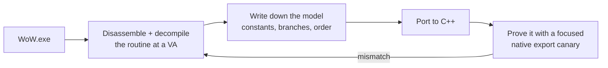

The old bots were built by decompiling the engine and reading memory values. So why not have the
agent dump the `WoW.exe` binary and reverse-engineer it?

That is the whole idea, and I want to be clear that it is not a clever one. Reverse engineering the
client is how this entire field has always worked — it is how the offsets in every bot I have ever
used were found. What changed was not the technique. What changed was that the tedious part, the
part that had always made it a specialist's job, was suddenly something I could delegate.

Sure enough, it was able to use Python and decompile major sections of the `WoW.exe` binary and was
not only able to reverse-engineer all of the physics and movement code, it was also able to refine
the packet lifecycle so that the clients' behaviors match 1 for 1.

## Two years, then forty-eight hours

| Date | Commit |
| --- | --- |
| 2026-03-21 | Decompile WoW.exe physics, update constants to exact binary values |
| 2026-03-22 | Decompile WoW.exe collision sweep: AABB 2-pass at 0x633840 |
| 2026-03-22 | Decompile WoW.exe spatial collision grid and contact system |
| 2026-03-22 | Decompile WoW.exe packet send pipeline and movement dispatch |
| 2026-03-22 | Document complete MovementInfo wire format from WoW.exe decompilation |

## The negative result first

`WoW.exe` is **not** a PhysX-style three-pass swept-capsule character controller.

That sentence saved more time than anything else in this project. Every open-source movement
implementation I had tried to adapt assumed something in that family, because that is what a modern
engine does and it is what the available code is written for. It is why my results varied — I was
not implementing a slightly wrong version of the client's model, I was implementing a completely
different model and tuning it until the symptoms got quieter.

What is actually in there is a closed-form movement state machine, a two-pass swept-AABB collision
step, and a grounded driver that selects a single contact. Older, simpler, and not what anyone
would write today.

## The difference between guessing and knowing

```cpp
// Before: a plausible number, tuned until the bot stopped falling through things.
constexpr float GRAVITY = 19.5f;   // "close enough"

// After: the value in the binary, at the address it lives at.
// WoW.exe 1.12.1 VA 0x0081DA58 — 0x419A542F as an IEEE-754 float.
constexpr float GRAVITY = 19.29110527f;

// The client precomputes its own multiples and stores them as globals.
// Port those too, or you accumulate rounding error the client never has.
constexpr float HALF_GRAVITY   = GRAVITY * 0.5f;  // VA 0x0081DA60
constexpr float DOUBLE_GRAVITY = GRAVITY * 2.0f;  // VA 0x0081DA64
constexpr float INV_GRAVITY    = 1.0f / GRAVITY;  // VA 0x0080E020

// Jump impulse is an immediate in the instruction stream, not a named global.
// 0x7C626F: 0xC0FE93D8 = -7.955547f  (negative because up is negative here)
constexpr float JUMP_VELOCITY = 7.955547f;
```

`19.5` versus `19.29110527` is not a meaningful difference over one frame. Over a two-second fall it
is the difference between landing where the server thinks you landed and being somewhere else, and
"somewhere else" is how a bot ends up under the floor.

The precomputed multiples are the detail I would have missed forever. The client does not divide by
gravity at runtime; it stores `1/GRAVITY` and multiplies. Do it the other way and you drift, slowly,
in a way that looks like a bug in your logic rather than a bug in your arithmetic.

## The method



The rule that came out of this is the most portable thing in the whole project: **port the
decompiled behavior first, then prove it with a narrow native export canary.** Never accept a
replay-drift gate, a string match, or "the bot got where it was going" as proof of a byte-level
port.

A bot arriving at its destination tells you nothing about whether your gravity is right. It tells
you the destination was reachable by something. That distinction is, in hindsight, the thing I got
wrong for two years.

## What it unlocked

Not just movement. The same work produced fall damage thresholds, swim speeds, safe-fall handling,
interact distances, and a packet lifecycle that matches the real client — which is what makes the
headless bots and the injected ones comparable at all.
