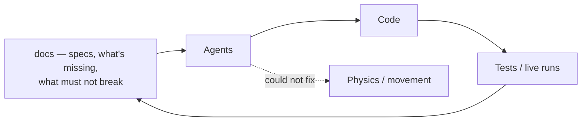

By early 2026 the solution had spread across a lot of separate projects, one for each piece of the
Westworld of Warcraft goal, and most of them were spec'ed out — every aspect of what the codebase
did was written down, along with what was missing and what was still expected to be implemented. I
had done that for myself, not for anyone else, because I kept losing three months at a time to other
hobbies and needed a way back in that didn't start with re-reading my own code from scratch.

None of this started with Claude. By this point ChatGPT and Copilot were already just part of how I
worked — pasting in a function to get a second opinion, letting autocomplete finish a boilerplate
block, the ordinary way most developers were already using both tools — and the PhysX-CCT model
from the last post was built with that kind of help in the loop the whole time.

Jared messaged me to say he'd tried the new Claude Code and that it would get me past my next
hurdle. I started using it, added Codex not long after, and knew within days that something about
this pair was different from what I'd had. What I did not expect was that it would still take months
to find out exactly how little that difference mattered to the one problem I actually needed solved.

## The number

Commit volume is the cleanest way to show what changed, so here it is, plainly:

| Period | Commits per month |
| --- | --- |
| 2024 average | ~7 |
| 2025 average | ~20 |
| Feb 2026 | 80 |
| Mar 2026 | 833 |
| Jul 2026 | 2,203 |

One commit that February reads "Claude overhaul WIP", and the ones around it have the texture of a
codebase being taken apart faster than it could be put back together: "The mother of all merge
commits", "Completely merged.", "Mess of a WIP." Behind those, a wave of `codex/*` and `agent/*`
branches showed up doing things I'd wanted for years and never scheduled — an evaluation of
Semantic Kernel, Serilog snapshot logging, a safety pass over the PvE rotation code, a base-class
refactor across the bot profiles, a full rewrite of the operator console from WPF to Blazor. None of
that was the reason I'd started. All of it got done anyway, because it turned out to be cheap once
there was an agent that could hold the whole change in its head at once.

## Why any of it worked

The part worth keeping from this whole stretch is not that the agents were fast. It's why they had
anything to work with in the first place, and I only understand that in hindsight.

Documentation written to remind yourself what a subsystem does, what it doesn't do yet, and what it
must never be allowed to do, turns out to be very close to the interface a coding agent actually
needs. I hadn't built that on purpose. I'd built it because I kept forgetting my own project.

## The wall did not move

None of that touched the thing I actually needed solved. I pointed Claude Code, then Codex, at the
physics and movement problem specifically — refactor after refactor, frame-by-frame comparisons
between what the background client did and what the real client did, going back over the same
capsule and collision code from a different angle each time. It was the same code ChatGPT and
Copilot had already had a turn at, and the same wall I'd been hitting for two years before any of
them showed up. Having a faster agent throwing itself at it did not make the wall move. It just
meant I could fail against it faster, and confirm the failure sooner.

Everything downstream of already knowing what I wanted got dramatically cheaper — refactors, test
scaffolding, migrations, the entire operator console rewrite. None of that reached upstream, to the
one problem where I didn't actually know what was wrong in the first place. An agent that generates
ten candidate fixes an hour instead of one a day is still just generating candidates if you have no
way to tell which one is right. Physics and movement stayed broken through March, through the
Semantic Kernel detour, through the console rewrite — through all of it.

