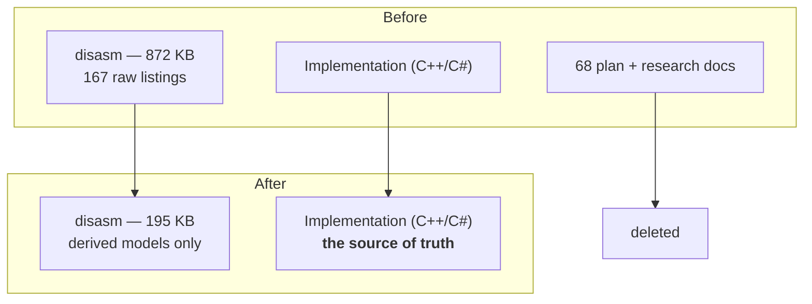

The fastest period in this project's history was also the one that required the most deletion. That
stops being a paradox once you have watched it happen, but it surprised me at the time.

## Verification, with a different instrument

On 2026-07-24 I had the physics port independently re-verified against the binary using Ghidra,
rather than the tooling that had produced the original decompilation. The point was to check the
work with a different instrument, not a different mood — same binary, same routines, different
decompiler, no access to the previous conclusions.

The result came back in three parts:

- The constants were **byte-exact**.
- The C++ movement-math ports were **correct**.
- The **documentation had drifted**.

Two heuristic constants on the C# side were wrong and were fixed. Everything else that was wrong was
in the notes describing the implementation, not in the implementation.

That is a specific and instructive failure mode. The code had been exercised, tested, and corrected
continuously for months — it was under pressure from reality. The documents describing it were
written once, at the moment a question was being actively worked, and then left alone while the
answer kept moving. Nothing forced them to stay true.

## The numbers

On 2026-08-01, in phases:

- **167 raw disassembly artifacts** removed. The disassembly directory went from **872,278 bytes to
  195,252** — a 78% reduction.
- **68 stale physics research documents and agent plans**.
- Across the whole pass: **235 files, −32,800 lines**.

The justification I wrote into the commit was that these were safe to remove *because* the
re-verification had happened. The implementation was confirmed correct against the binary; standing
guidance was therefore to trust the code over the notes; and notes that are not authoritative are
not evidence of anything.

The word I used at the time was "adversarial" — I went looking for reasons each file should die,
rather than reasons to keep it. Every instinct pushes the other way. Deleting a decompiled listing
feels like destroying hard-won work, even when the value it contained has been extracted, verified,
and written into a header file with the virtual address in a comment.

## The practical reason

There is a less principled reason too, and it is worth saying plainly: the repository had grown to
the point where it was crashing the agents and the machines working on it.

Context is finite. A documentation tree that an agent must search is not free — it is a tax on every
task, forever. Eight hundred kilobytes of raw objdump listings sitting in a directory that gets
searched whenever anyone asks about movement is a cost paid on every question about movement. And
those listings had already done their job. They were the raw material from which the model was
derived, and the model now lived in the code, verified against the binary by two independent tools.

This is a genuinely new category of engineering problem for me. In a human-only codebase, a stale
document is a mild hazard — someone might read it and be misled. In an agent-assisted one it is an
active load-bearing cost, because the agent *will* read it, will weight it, and cannot tell from
tone that it has been superseded.

## The rule

Machine-generated intermediate artifacts are scaffolding.

They are evidence while a question is open and dead weight the moment it closes. The skill is
telling which one you are looking at. A decompiled listing of a routine you are actively porting is
the single most valuable file in the repository. The same file, after the port is written, tested,
and independently verified, is four kilobytes of noise that will surface in every future search for
the word "movement".

A few concrete habits came out of it:

- **Derived models live in the repo. Raw dumps do not.** A header comment saying
  `// VA 0x0081DA58: 19.29110527 (0x419A542F)` carries the whole finding in one line.
- **When code and docs disagree, the code wins, and the doc is deleted rather than repaired** — if
  it drifted once, it will drift again.
- **Verification is what licenses deletion.** The cull was only safe because the re-verification
  came first. Reverse that order and you are not pruning, you are discarding evidence.

Git still has all of it, which is how I was able to write this post.


