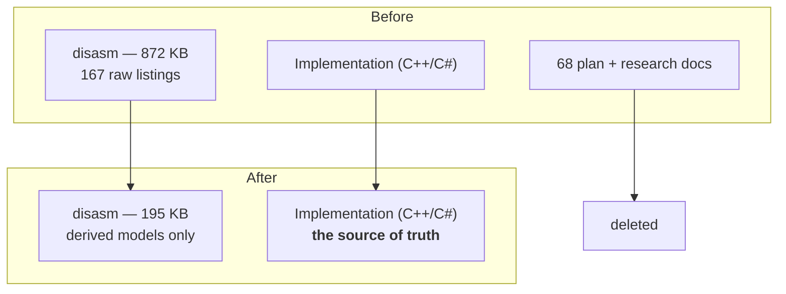

The fastest period in this project's history was also the one that required the most deletion. That
is not a paradox once you have watched it happen, but it surprised me at the time.

## First, verification

On 2026-07-24 I had the physics port independently re-verified against the binary, using Ghidra
rather than the tooling that produced the original decompilation. The point was to check the work
with a different instrument, not a different mood.

The result came back in three parts:

- The constants were **byte-exact**.
- The C++ movement-math ports were **correct**.
- The **documentation had drifted**.

Two heuristic constants on the C# side were wrong and were fixed. Everything else that was wrong
was in the notes describing the implementation, not the implementation.

That is a specific and useful failure mode. The code had been tested, exercised, and corrected over
months. The documents describing it had been written once, by an agent, at the moment a question
was being worked on — and then left alone while the answer moved.

## Then, the cull

On 2026-08-01, in phases:

- **167 raw disassembly artifacts** removed. The disassembly directory went from **872,278 bytes to
  195,252**.
- **68 stale physics research documents and agent plans**.
- Total across the pass: **235 files, −32,800 lines**.

The justification I wrote in the commit message was that these were safe to delete *because* the
re-verification had happened: the implementation was confirmed correct, standing guidance was to
trust the code over the notes, and therefore the notes were no longer evidence of anything.

## The practical reason

There is a less principled reason too, and it is worth saying out loud: the repository had grown to
the point where it was crashing the agents and the machines working on it.

Context is finite. A documentation tree that an agent has to wade through is not free — it is a tax
paid on every single task, forever. Eight hundred kilobytes of raw objdump listings, sitting in a
directory an agent will search when you ask it about movement, is a cost you pay every time you ask
about movement. And the listings had already done their job: they were the raw material from which
the model was derived, and the model was now in the code, verified.

## The rule

Machine-generated intermediate artifacts are scaffolding.

They are evidence while a question is open, and dead weight the moment it closes. The skill is
telling which one you are looking at. A decompiled listing of a routine you are actively porting is
the most valuable file in the repository. The same file, after the port is written, tested, and
independently verified, is 4 KB of noise that will be retrieved by every future search for the word
"movement".

Delete accordingly. Git still has all of it, which is how I was able to write this post.
