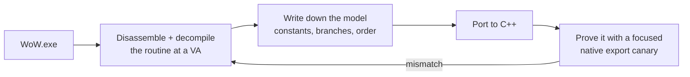

The old bots were built by decompiling the engine and reading memory values. So why not have the
agent dump the `WoW.exe` binary and reverse-engineer it?

I want to be clear that this is not a clever idea. Reverse engineering the client is how this entire
field has always worked — it is where every offset in every bot I have ever used came from. What
changed was not the technique. What changed was that the tedious part, the part that made it a
specialist's job measured in months, became something I could delegate.

The previous two years had a specific shape: I had no ground truth, so I tuned constants against
symptoms, and throughput does not help when the thing slowing you down is that you do not know the
answer. The binary *is* the ground truth. It had been sitting on my disk the whole time.

## Two years, then forty-eight hours

Over two days in late March, five pieces came out of the binary, one after another:

- the physics, with every constant replaced by the exact value stored in the binary
- the collision sweep: a two-pass AABB at `0x633840`
- the spatial collision grid and the contact system
- the packet send pipeline and movement dispatch
- the complete `MovementInfo` wire format

The negative result came first, and it was the one that mattered most: `WoW.exe` is **not** a PhysX-style three-pass swept-capsule character controller.

That sentence saved more time than anything else in this project. Every open-source movement
implementation I had tried to adapt assumed something in that family, because that is what a modern
engine does and what the available code is written for. It explains why my results *varied* rather
than being consistently wrong: I was not implementing a slightly incorrect version of the client's
model, I was implementing a different model and tuning it until the symptoms quietened down.

What is actually in there is older and simpler:

- a **closed-form movement state machine** handling commands, speed, gravity, jump, fall and swim;
- a **two-pass swept-AABB collision step** — an axis-aligned box, not a capsule;
- a **grounded driver that selects a single contact** and resolves against it, rather than
  accumulating several.

Nobody would write it this way today, which is exactly why guessing failed. Every modern
open-source physics stack solves a harder, more general problem than the one `WoW.exe` is actually
solving, and a more general solution does not degrade gracefully into a more specific one.

The base movement numbers turned out to be almost embarrassingly plain once I had them: walking at
2.5 yards a second, running at 7, a jump impulse of about 7.96 yards per second that becomes about
9.1 in water. None of that required cleverness to find. It required not guessing.

## Constants, and why the exact bits matter

```cpp
// Before: a plausible number, tuned until the bot stopped falling through things.
constexpr float GRAVITY = 19.5f;   // "close enough"

// After: the value in the binary, at the address it lives at.
// WoW.exe 1.12.1 VA 0x0081DA58 — 0x419A542F as an IEEE-754 float.
constexpr float GRAVITY = 19.29110527f;
constexpr float HALF_GRAVITY   = GRAVITY * 0.5f;  // VA 0x0081DA60
constexpr float DOUBLE_GRAVITY = GRAVITY * 2.0f;  // VA 0x0081DA64
constexpr float INV_GRAVITY    = 1.0f / GRAVITY;  // VA 0x0080E020
// Jump impulse is an immediate in the instruction stream, not a named global.
constexpr float JUMP_VELOCITY = 7.955547f;  // 0x7C626F
```

`19.5` versus `19.29110527` is meaningless over one frame. Over a two-second fall it is the
difference between landing where the server thinks you landed and being somewhere else — and
"somewhere else" is how a character ends up under the floor.

The precomputed multiples are the detail I would never have found by reasoning. The client does not
divide by gravity at runtime; it stores `1/GRAVITY` and multiplies. Implement it the obvious way and
you drift slowly, in a pattern that looks like a logic bug rather than an arithmetic one.

`TERMINAL_VELOCITY` is the best example of why decompilation beats inference. It is not a literal in
the binary at all — it is computed at startup as `55.0 × 1.0936`. You can observe the resulting
number forever without ever learning that it has *factors*, and without knowing the factors you
cannot tell which one changes when something modifies fall behavior. The fall damage constants have
a similar shape: the binary stores `10.0` and `11.111111` (which is `100/9`), and two init functions
square them and store the results as separate globals. Find only the squared globals and you will
never guess what they are.

## The collision model

Once the constants were right, the geometry work followed the same method. By the time it was done,
the physics engine was mapped to the binary address by address:

| VA | Role in WoW.exe |
| --- | --- |
| `0x618C30` | per-frame movement update entry into collision |
| `0x633840` | `CollisionStep` — AABB setup and mode dispatch |
| `0x6373B0` | AABB merge for start / full-step / half-step bounds |
| `0x6721B0` | `CWorldCollision::TestTerrain` — terrain and static contact query |
| `0x6AA8B0` | spatial collision grid root and per-chunk traversal |
| `0x6367B0` | grounded selected-contact driver |
| `0x636610` | blocker-axis merge |
| `0xC4E52C` | selected-contact container (capped at 0x100 entries) |

The shape of it, once you can see the whole thing, is dull in the way correct engineering code
usually is: a per-frame entry point dispatches into AABB setup, which merges start, full-step, and
half-step bounds, queries the spatial grid for terrain and static contacts, and hands the result to
the grounded driver that picks a single contact to resolve against rather than accumulating several.
None of that is exotic. It is just specific, in a way that no amount of staring at replay footage was
ever going to make it. Every one of those routines got its own focused canary before I trusted it,
and the canary is what turned "I think this matches the binary" into something I could actually
check on demand instead of hoping.

## The method, and the rule



The rule that came out of this is the most portable thing in the project: **port the decompiled
behavior first, then prove it with a narrow native export canary.** Never accept a replay-drift
gate, a recorded-corpus comparison, a log-string match, or "the bot got where it was going" as proof
of a byte-level port.

A bot arriving at its destination tells you nothing about whether your gravity is correct. It tells
you the destination was reachable by *something*. That distinction is, in hindsight, precisely what
I got wrong for two years — I was validating against outcomes when I needed to validate against
mechanisms. There was no earlier disassembler in this project's history that this replaced; it went
straight from two years of guessing to an agent driving static decompilation with Python.

I keep coming back to how ordinary the actual mechanism of doing this turned out to be. The agent
was not doing anything I could not, in principle, sit down and do myself with a disassembler and a
lot of coffee. It read a routine, described what the routine did in plain terms, and I checked that
description against the C++ it then wrote. What made it different from the specialist's job that
used to take months was not insight, it was that none of the individual steps required a human to be
patient for very long, and there could be a great many of those steps in a single afternoon.

## Four months later, an audit

By July the ported model had been running for months, and the thing it had not yet had was
independent verification against the binary itself — every check up to that point had been against
my own notes about the binary, which is a weaker claim than it sounds like. Documentation drifts.
A comment gets written down slightly wrong once, gets trusted, and then everything built on top of
it inherits the mistake without anyone noticing, because nothing downstream is checking the binary
again — it is checking the note about the binary. In late July I imported `WoW.exe` into a running
Ghidra MCP project and went back through the FG/BG physics parity rows one at a time, checking each
constant and each routine against the actual bytes and Ghidra's own decompilation, not against what
I had written down about them in March.

Ghidra's role here was confirmation, not discovery. Nothing in this pass was new — the constants and
the routines had already been decompiled and ported months earlier. The question was narrower: did
the port match the binary, and did my documentation of the port match either one. The answer split
in an unglamorous way. The constants were byte-exact, and the C++ movement-math ports were correct —
the March work held up under a second, independent look with a different tool. But two C# heuristic
constants on the BotRunner side were wrong, and got fixed the same day, along with a vertical-wall
corner-slide bug near a specific gate that the audit's fresh eyes caught. The implementation was
right where it mattered most. Some of the surrounding notes describing it were not, and those got
corrected instead of trusted.

What the March decompilation actually unlocked was never just movement. It was interact distances,
fall-damage thresholds, swim speeds, and a packet lifecycle that finally matches the real client —
every behavior downstream of knowing the physics is right. The July Ghidra pass did not add any of
that. It proved the March work had actually gotten there.

