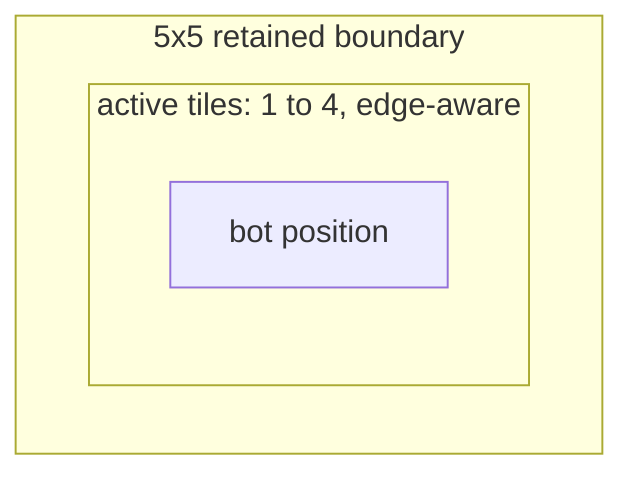

A background bot has no client rendering the world for it. That sounds obvious once you say it,
but it took me a while to feel the actual weight of the sentence. The foreground client's WoW.exe
gets handed a terrain mesh, a set of collision models, and a renderer that turns all of that into
pixels the player squints at. The background client gets none of it. It gets packets. If you ask a
background bot to stand still, it can do that forever and never once know what the ground under it
looks like. The moment you ask it to do anything else — walk somewhere, decide if a wall is in the
way, figure out whether a ledge is fifteen yards off or a hundred and fifty — it needs an answer to
a question the client would normally answer for free: what does the world actually look like here.

That question is separate from the one everybody assumes is the hard part, which is what to do
with the answer once you have it — whether a capsule can climb a given slope, whether two polygons
actually collide, whether the physics matches what the original client would have done. That fight
is the subject of the last several posts, and it's the reason this one comes after them rather
than before: there was no real pressure to solve geometry delivery at scale until the physics and
collision math on the other end of it was actually worth feeding. Once the decompiled model was
ported and proven, a single bot asking for terrain data on the fly wasn't the bottleneck anymore —
many bots doing that at once was, and that's a data-serving problem, not a physics one.

## Reaching into the MPQ archives directly

Long before there was anything you could call a service, there were parsers. Mid-2025, well before
any of this needed to answer to more than one bot at a time, I was writing code that reached
directly into the WoW MPQ archive format to pull out ADT terrain and VMAP collision data — a
"Working ADT Terrain parser" landed 2025-06-17, a "'Working' VMAP polygon tester" followed a few
weeks later on 2025-07-07, with assorted height, liquid, and line-of-sight passes scattered through
the middle of that year. This is the part of the project I can tell you the least about with any
confidence. The commit log for that stretch is thin, the messages are short, and I honestly don't
remember all the specifics of how the byte layout for ADT chunks or VMAP node trees got worked out.
Some of that groundwork is just a little lost to history at this point. What I do know is that by
the time anything needed this data on a per-bot, per-request basis, the raw parsing already worked
and had for the better part of a year.

At that stage there was no notion of a service. Whatever needed geometry — a height check, a
collision test — reached straight into that parsing code for whatever it needed at the moment,
inline. That's fine when you have one thing asking one question. It stops being fine the moment you
have background bots, plural, each wanting terrain data on demand, and each one loading a fresh
copy of a rather large parser to get it.

## The service is born

2026-03-29 is the commit that actually named the thing: "Add SceneDataService + SceneDataClient
for on-demand collision data." A single process loads the VMAP and ADT data for a map once, keeps
it warm, and answers requests from bots over TCP for scene grids around a given position. Under the
hood it leans on a native Navigation library call to pull triangles back out of the map data rather
than re-deriving them by hand for every request. Worth a one-line mention and no more: this commit
is already from the era where an AI agent is a listed co-author on the change. Not the subject of
this post — that story gets its own later — just a small fact about the timeline.

Early April wired the new service into the StateManager, then immediately ran into the kind of
problems you'd expect from a shared process suddenly getting hit from multiple bot threads at once:
thread-safety issues, host-builder wiring that needed partial reverting and re-fixing, and enough
confusion about per-map preload timing that logging had to be added just to see what was happening
during startup.

## April 7th, and the pivot to tiles

One day did most of the real work of turning this from "a service that answers position queries"
into something that could actually scale. 2026-04-07 has four commits that all matter:

- "Fix SceneDataService — ground-focused Z range + no mmap loading" — an explicit decision to stop
  loading full mmap navmesh data just to answer a scene query. The service only needed enough
  vertical range to know what's near the ground, not the whole column.
- "Drop normals from tile wire format — vertices only, ~2x throughput" — the wire format had been
  shipping normals nobody was using yet, and cutting them roughly doubled how much tile data could
  move per second.
- "GZip compress tile vertex data on wire — 1.5x more throughput" — compression on top of that, for
  another one and a half times.
- "Add SceneTileSocketServer: pre-loads .scenetile files, serves by tile key" and "Add tile-based
  scene architecture (533y ADT tiles)" — the actual pivot. Instead of asking the service for "a
  grid around this position" and making it figure out what that means fresh every time, bots ask
  for specific tiles by a fixed key, matching WoW's own 533-yard ADT tile grid. The service
  pre-loads `.scenetile` files and serves them straight from that index.

That last pair is the change that made everything downstream simpler, because it turned a fuzzy
spatial query into a lookup.

## The edge-aware window and the 5x5 margin

The design that actually stuck, and the one I think is worth explaining slowly, is how a background
bot decides which tiles it needs and when to let go of the ones it doesn't. Each bot tracks the set
of tiles it currently holds. On every update it works out the smallest set of tiles its position
actually needs: the tile it's standing in, plus a neighbor only when it's within 100 yards of the
edge facing that neighbor. In the middle of a tile that's one tile; near an edge it's two; near a
corner, four. It requests whichever of those it doesn't already have. That part's the easy half.

The harder half is eviction, and it's the part that isn't obvious until you've been burned by not
having it. If a bot evicted every tile the instant it fell out of that active set, then a bot
standing near a tile boundary — which is most of the time, tile boundaries aren't rare — would load
and evict the same tile over and over as it jittered a few units back and forth across the line. So
eviction uses a much wider margin: a bot only drops a tile once it falls outside a 5x5 neighborhood
around the tile it's standing in, not the one to four tiles it actively uses. The gap between the
two is hysteresis. A tile has to leave the bigger boundary before it's actually let go, so ordinary
movement near an edge doesn't turn into a request-evict-request-evict loop.

_Corrected 2026-10-08: an earlier version of this post described the active window as a fixed 3x3
grid. The code never worked that way; the shared architecture standard said 3x3, and so did this
post, until a component audit compared both against the source._

It's a small idea and it isn't original to this project — hysteresis bands show up anywhere you
have a threshold and something noisy crossing it — but it's the single piece of this service that
actually made the tile-based approach hold up under bots that don't stand still.

Later tightening moved in the same direction: 2026-07-20's "Require SceneDataService for BG physics
geometry" made the service load-bearing rather than optional for background bots, and "Reduce BG
SceneData slice injection size" shrank how much tile data got pushed into a bot's working set at
once, on the theory that a bot rarely needs to hold more than its immediate neighborhood no matter
how the number looked on paper earlier.

## What this actually bought

What came out of all of that is a background bot that can hold a moving window of world geometry —
never the whole map, never anything close to it — and ask two kinds of question against it: can I
stand here, and what's fifteen yards in that direction. It never loads a client. It never renders
anything. It just keeps asking a service for the handful of tiles around wherever it happens to be,
and lets go of the ones it's left behind.

That's the part this post is actually about — not whether the physics on top of this data is any
good, which by this point it already was, but whether it could be fed cheaply enough to run for
however many bots happened to be online at once. Having a correct model of how a capsule slides
across the ground is not the same problem as getting the ground to every bot that needs one, and
this is what it took to stop the second problem from undoing the first.

