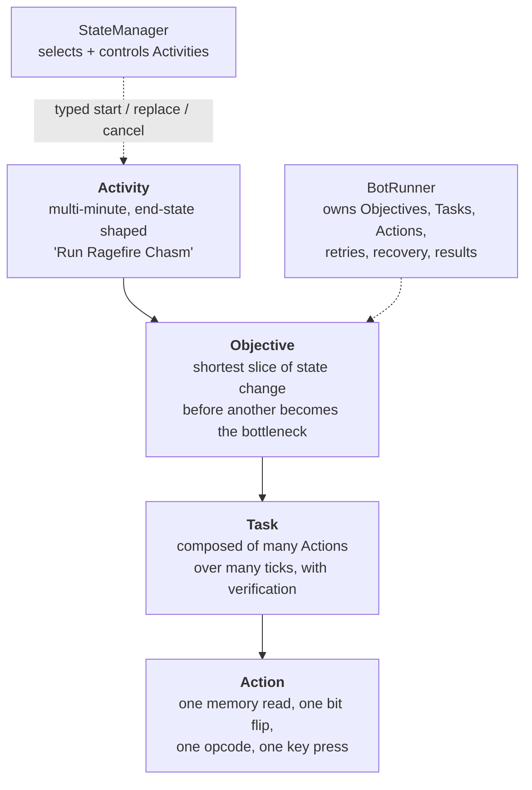

This is the status post. It is accurate as of writing and it will be wrong soon, which is the
intended outcome.

## The shape of the solution

The code divides into shared libraries and native components on one side, and worker services on the
other.

**Shared** — the game interfaces every behavior is written against (deliberately dependency-free,
sitting at the bottom of the stack); the behavior engine; the pure-C# protocol implementation; the
protobuf IPC layer; and the native C++ navigation, pathfinding and physics.

**Services** — the StateManager (orchestration, foreground injection, fleet policy), the foreground
and background runtimes, pathfinding, scene data, decision making, and prompt handling. Plus the
class profiles, a Blazor operator console, and the offline tools including the navmesh generator.

## The behavior model

Four layers: **Activity → Objective → Task → Action**.

The definition in the middle took longest to arrive at. An **Objective** is the shortest slice of
state change the bot can finish before another Objective becomes the next bottleneck. Not "a step",
not "a subtask" — the shortest thing worth finishing before the question of what to do next
genuinely changes.

The granularity rule at the bottom is worth stating precisely, because getting it wrong collapses
the whole hierarchy. `MoveToCoord`, `CastSpell`, `LootCorpse`, `InviteToParty` are **Tasks** — each
composes many Actions across many ticks and verifies the result. An **Action** is the smallest
possible primitive: one memory read, one bit flip, one opcode send, one key press.

And an honest note, because this is a status post: **the Action layer is target state, not shipped
code.** There is no `IAction` interface and no `Actions/` directory. Today a Task calls the object
manager's helpers and the packet surface directly. I keep that gap labelled in the docs rather than
describing the design as though it exists, because the alternative — documentation that describes
intentions in the present tense — is exactly what produced the drift in the previous post.

## The execution boundary

The line between StateManager and BotRunner is the architectural decision I am most confident about,
and it was arrived at by migration rather than design.

StateManager owns Activity selection, fleet policy, snapshots and receipts. BotRunner owns Objective
composition, Tasks, Actions, retries, recovery and terminal results. The only downward gameplay
contract is typed Activity control: start, replace, cancel. Objective and Task fields on a snapshot
are observability witnesses — they let you see what a bot is doing, and they are explicitly not
commands.

Earlier versions leaked in both directions, because when the StateManager can see everything, pushing
decisions up into it is always the path of least resistance. Pulling that back took months of
commits with titles like *"Remove StateManager progression objective path"* and *"enforce BotRunner
activity execution boundary"*.

The general principle: **the component with the best view is not automatically the component that
should decide.** The StateManager can see the whole fleet, which makes it the obvious place to put
any decision — and the wrong place for any decision that needs the local, high-frequency state only
the runner has.

## Testing, honestly

Roughly **7,200 automated tests** across the suites, in three tiers:

| Tier | What it is | Cost |
|---|---|---|
| Unit | Hermetic, no server contact. Protocol, behavior engine, profiles, console. | Seconds to minutes |
| Live | Real client against a locally hosted server emulator. | A client, a login, and a human watching |
| World-sim | Server behavior executed inside unit tests, frame by frame. | Cheap, but only covers modelled encounters |

The middle tier is the expensive one and it has not gone away. A live run still requires booting at
least one foreground client and logging in, so a person can observe what is going on in case
something goes wrong.

The third tier exists to attack that cost. I considered how accurate the background client had
become and decided it was worth building a world-server harness that uses server code behavior
inside unit tests, so it can emulate the world — or at least specific encounters — frame by frame,
and assert that bots perform exactly as requested. It does not remove the human from the loop. It
moves the human to milestone boundaries instead of every run.

Two details from the test infrastructure worth passing on. First, the x86 constraint from the very
first post reaches all the way here: some suites must build 32-bit because they exercise injection
paths, and others must not. Second, every test lane runs through a job that takes a per-repository
lock, and the published result file is the artifact of record — a local run is not. That rule exists
because an agent that can run its own tests will, given enough attempts, find a way to believe it is
green.

## Then and now

The inter-process contract in June 2024 was twenty lines of protobuf: an opaque payload, an error
channel, and a `oneof`.

Today it is **5,449 lines across five `.proto` files** — activity control and cancellation
handshakes, snapshot queries, runtime readiness, catalogs, performance history, service health,
world sessions, on-demand activity requests. Same framing, same 4-byte length prefix, two years of
consequences.

## What does not work yet

Bots do not complete dungeons unattended. Group coordination is real but shallow — they form up,
travel and fight together, and they do not yet adapt to each other the way a party does. Quest
coverage is partial. The Action layer is a design, not code. The persona layer is advisory only: it
colours what a bot says and has no authority over what a bot does.

And nothing here would survive contact with a human who was actually trying to work out which
characters were bots. That remains the whole point, and it remains a long way off.

The solution is leaps and bounds ahead of where it was, and it continues to accelerate toward being
a working one.


