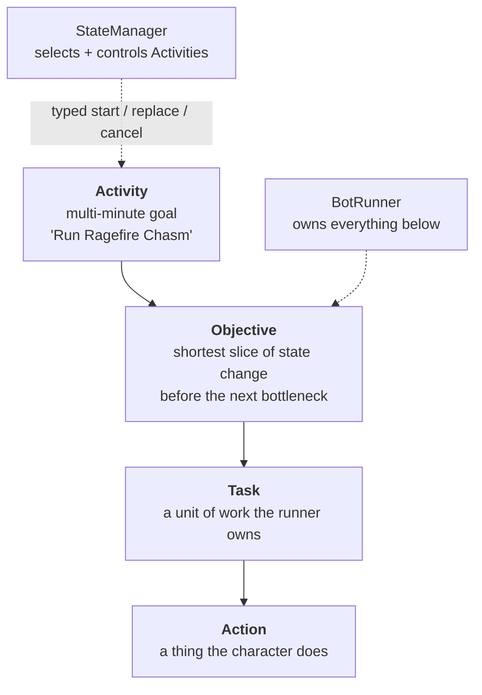

After some time ironing out all of the previous bad solutions and jank code I wrote or generated, I
was able to get the solution to where it was measuring things properly and had the test frameworks
as I described them.

This is the status post. It is accurate as of writing and it will be wrong soon, which is the
intended outcome.

## The shape of the solution

Shared libraries and native components on one side — the game interfaces, the behavior engine, the
protocol implementation, the IPC layer, and the C++ navigation and physics. Worker services on the
other — the StateManager, the two runtimes, pathfinding, scene data, decision making, prompt
handling. Then the class profiles, the operator UI, and the offline tools.

The behavior model is four layers:

The definition in the middle is the one that took longest to arrive at. An **Objective** is the
shortest slice of state change the bot can finish before another Objective becomes the next
bottleneck. Not "a step". Not "a subtask". The shortest thing worth finishing before the question
of what to do next genuinely changes.

The line between the two owners is the architectural decision I am most confident about, and it was
arrived at by migration rather than design. Earlier versions leaked objective callbacks and
progression logic upward into the StateManager, because that is the path of least resistance when
the StateManager is the thing that can see everything. Pulling it back took months.

## How it is actually tested

I had separated out the BotRunner logic and a lot of the background client code into unit tests,
while live runs were performed against a locally running WoW server emulator. This is still time
costly, as it requires booting at least one foreground client and logging in so that a person can
observe what's going on just in case.

So, three tiers, honestly described:

- **Unit lanes.** Hermetic, no server, fast. Most of the behavior engine and protocol work lives
  here.
- **Live runs.** Against a locally hosted server emulator. Costs a real client, a real login, and a
  human watching. This is the expensive tier and it is still necessary.
- **A world-server harness.** I considered how accurate the background client was and decided we
  could spend some time working on a world-server unit test, where we use server code behavior in
  our unit tests so it can emulate the server world — or at least certain encounters — on a
  frame-by-frame basis, so we can make sure the bots perform exactly as requested.

For now, this still requires a human in the loop to verify at various small milestones.

## Then and now

The inter-process contract in June 2024 was twenty lines of protobuf: an opaque payload, an error
channel, and a `oneof`. Today it is 5,449 lines across five files — activity control, cancellation
handshakes, snapshot queries, readiness, catalogs, health, session management.

Same framing. Same idea. Two years of consequences.

## What does not work yet

Bots do not complete dungeons unattended. Group coordination is real but shallow — they form up,
they travel, they fight, and they do not yet adapt to each other the way a party does. Quest
coverage is partial. The persona layer is advisory only: it can colour what a bot says, and it has
no authority over what a bot does. Nothing here would survive contact with a human who was actually
trying to work out which characters were bots.

The solution is leaps and bounds ahead of where it was and it continues to accelerate to being a
working solution.
