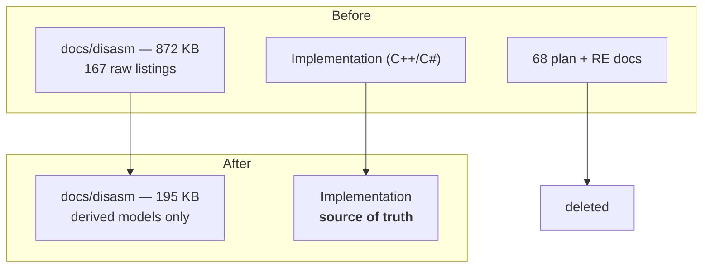

The July Ghidra pass from "Decompile the Binary" ended on what felt like a side note: the
implementation was right, and some of the notes describing it were not. That felt like a small,
contained finding at the time. It turned out to be the first sign of a much bigger cleanup problem.

## What the drift was actually telling me

The cull's own commit messages call the March and April material "pre-Ghidra disassembly
artefacts" — not a label I invented for this post, just the project's own name for the first of the
two stages: a first-pass model dumped out with Python, then a Ghidra audit months later that
re-checked it with a different tool.

Once I saw it that way, the drifted doc stopped looking like an isolated mistake and started looking
like a symptom. If one document had quietly stopped matching reality while the code kept moving
under test and correction, there was no reason to think it was the only one. The repository had
accumulated an enormous amount of material from the first stage — raw listings, research notes,
agent plans written while a question was still open — and none of it had any mechanism for staying
current once the question closed.

## The cull

At the start of August I went through it in phases. The raw disassembly directory lost 167 artifacts, dropping
from 872,278 bytes to 195,252 — a reduction of about 78%, and what remained afterward was derived
models only, not raw listings. Alongside that, 68 stale physics reverse-engineering documents and
agent plans came out, material written during the decompile phase that had no reason to survive past
the audit that superseded it. Across the whole pass it came to 235 files and about 32,800 lines
removed.

The justification I wrote into the commit was close to this: these were safe to remove because
Ghidra had already re-verified the implementation, and the standing guidance from that point on was
to trust the code over the notes. That's a philosophical position, and I believe it, but it wasn't
the reason I actually did it on that particular day.

## The practical reason

The practical reason is plainer and less flattering: the repository had grown to the point where its
size was crashing the agents and the machines working on it. Context is finite, and a documentation
tree a model has to wade through before it can answer a question is not free. Eight hundred and
seventy-two kilobytes of raw disassembly listings sitting in the same directory tree as the movement
code is a tax paid on every single task that touches movement, whether or not that task needed the
listings at all. The bill comes due quietly, one search at a time, until it doesn't.

## The rule

The rule that came out of this is simple enough to state once and be done with it: machine-generated
intermediate artifacts are scaffolding. They're evidence while a question is open, and dead weight
the moment it closes. The job is deciding which one you're looking at, and deleting accordingly. Git
still has all of it, if anyone ever needs to look back.

The fastest period in this project's history was also the one that required the most deletion. I'm
not sure that's a coincidence.

