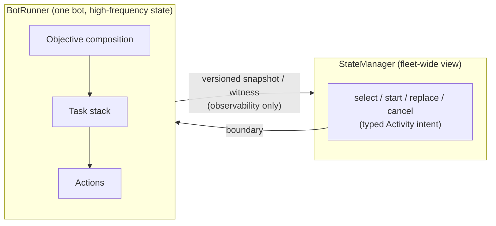

I went looking for the count out of curiosity more than anything, because I'd started to suspect
the answer would be embarrassing. `communication.proto`, Jared's twenty-line file from June 2024,
the one I showed in full a few posts back — an opaque payload, an error channel, and a `oneof` to
tell them apart — is not one file anymore. The inter-process contract between the StateManager and
the BotRunner is now five `.proto` files totaling 5,449 lines: activity control and cancellation
handshakes, snapshot queries, runtime readiness, catalogs, performance history, service health,
world sessions, on-demand activity requests. Same framing underneath all of it, still a four-byte
length prefix in front of every message. Two years of consequences sitting on top of an idea that
used to fit on one screen.

The line that contract draws — who gets to decide what, between the process that can see the whole
fleet and the process standing next to one character — is the architectural decision I'm most
confident about in this whole project today. It did not arrive that way. Nobody sat down in 2024
and drew it. It got found by shipping the wrong version of it, twice, and then walking it back.

That original file did one job: it let a bot say "here is my state" and let the StateManager say
"here is your next task, if it changed." A single loop, edge-triggered so it stayed quiet most of
the time. That was the entire relationship. There was no concept yet of an Activity that took
minutes to run, no idea of a Task stack living somewhere, because there was barely enough code on
either side to need the distinction. The distinction showed up on its own, later, once the
BotRunner side grew enough internal machinery that "your next task" stopped being a sensible thing
to hand down from outside.

## What the line actually says

Here's the contract as it stands, stated plainly rather than as a diff of message types. The
StateManager can select an Activity, start it, replace it, cancel it, and observe it. An Activity
is a multi-minute, end-state-shaped goal — "run Ragefire Chasm," not "swing your weapon now." That's
the entire vocabulary the StateManager is allowed to speak downward. It is explicitly forbidden from
sending an Objective, a Task, an Action, an execution recipe, or the result of any lower-level
decision. Objective composition and progression, the Task stack, Actions, retries, recovery, and
the terminal result of the whole thing — all of that belongs to the BotRunner, and none of it
crosses the wire.

The only channel running back up to the StateManager is a versioned snapshot, sometimes called a
witness in the spec, and it is observability only. The StateManager can read it. It cannot use
anything in it to instruct the BotRunner. It doesn't get to look at a witness, notice the bot is
between Objectives, and push one down to fill the gap — that's exactly the shape of bug this line
exists to prevent, and I'll get to why in a minute.

The concrete version of this, the one that made the abstraction click for me when I was writing the
spec down, is: Actions never cross a wire. An Action is the smallest unit of bot behavior there
is — one memory read, one packet, one key press. It never gets serialized. It never gets a message
type. It happens entirely inside the process that's actually closest to the game, and the
StateManager never even hears that it happened, only that something upstream of it eventually
finished.

## Why it leaked, twice

The reason this took years instead of a design meeting is straightforward once you say it out
loud: the StateManager can see everything about the whole fleet, and pulling a decision up to the
place that already has the most information in front of it is the path of least resistance,
whether or not that place is the right owner for it.

So it happened. More than once. The commit log has titles like "Remove StateManager progression
objective path" and "enforce BotRunner activity execution boundary," landing at the end of August,
which tells you the fix wasn't quiet — something had drifted far enough that it needed a named
correction of its own. Two weeks before that there's a separate "stop-line correction" in the spec
itself, which is its own tell: the stop line, the exact point where the StateManager's authority
ends, had moved somewhere it shouldn't have and had to be corrected back. I'm not going to pretend
these were the last ones, either. As of the most recent pass through the spec, both corrections are
still marked current, not historical — meaning this boundary is still being actively renegotiated
right now, not a design that got settled once in 2024 and left alone since.

Each time, the decision went into the StateManager before the BotRunner side had grown its own
opinion about it, and months later, once the BotRunner could own it properly, someone had to notice
the StateManager was still making it and write the commit that took it back out. Every correction
so far has been subtractive: the fix was never "add a rule," it was "remove the thing that snuck
up."

The general shape underneath all of it: the component with the best view is not automatically the
component that should decide. The StateManager is the wrong place for any decision that needs the
local, high-frequency state that only the runner sitting next to that one character actually has —
where its feet are this tick, what's on top of its Task stack, whether the last Action landed. By
the time that state has been serialized, shipped across a socket, and reasoned about somewhere
else, it's already stale — and now the fleet-wide brain is making moment-to-moment calls off data
that was true a network round-trip ago.

## The witness, and staying honest about drift

The one thing crossing the boundary in the other direction — that versioned snapshot — has been
through several revisions since the first one, and every one of them has been strictly additive.
New fields get appended; nothing gets renumbered or repurposed out from under an old reader. That
sounds like a small courtesy, but it's the only reason the two sides of this contract can be
upgraded independently at all. The StateManager and the BotRunner do not get redeployed in lockstep.
A newer BotRunner talking to an older StateManager, or the reverse, is a normal Tuesday, not an
incident, and there are explicit rules for what happens when the two sides advertise different
witness versions and have to agree on which grammar they're actually speaking. Getting that
downgrade behavior wrong would quietly undo everything the ownership boundary is for, because a
StateManager that misreads a witness is a StateManager one step from acting on it.

That's as far as this side of the boundary goes. What actually happens once an Activity lands inside
the BotRunner-owned box — how it gets decomposed into Objectives, and where a small ML tiebreaker
ended up fitting into that — is a different post.

