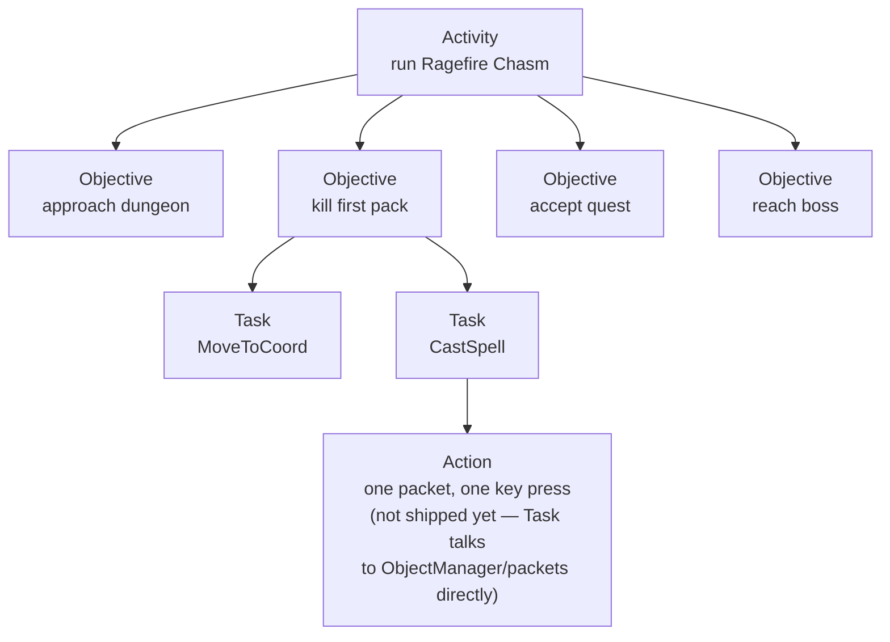

Last post drew the line: the StateManager gets to say "run Ragefire Chasm," and everything below
that sentence belongs to the BotRunner. Objective composition, the Task stack, retries, recovery,
the terminal result — none of it crosses the wire. What I didn't say is what "run Ragefire Chasm"
actually turns into once it lands inside that BotRunner-owned box. That's a separate problem, and
it's the one this post is actually about.

## Four layers, one example

The acronym for the four layers is AOTA — Activity, Objective, Task, Action — and it's easiest to
explain by running one goal down through all four instead of defining them in the abstract.

"Run Ragefire Chasm" is an Activity. It's multi-minute, it's shaped like an end state rather than
an instruction, and it's the only vocabulary the StateManager is allowed to hand down. The
BotRunner receives that Activity and has to turn it into something it can actually execute tick by
tick, and the first thing it produces is a sequence of Objectives: approach the dungeon entrance,
enter the instance, kill the first pack, accept whatever quest is sitting at the first quest giver,
navigate to the boss, kill the boss, loot, leave. Each Objective, in turn, is carried out by one or
more Tasks — `MoveToCoord`, `CastSpell`, `LootCorpse` — and a Task is the layer that actually knows
how to keep trying: it composes many Actions across many ticks, checks its own progress, and
verifies the result before it reports back up that it's done. `IBotTask` is a stable, shipped
contract; it's been the async backbone of bot behavior for a long time and nothing about AOTA
changed that.

Below Tasks is the layer that doesn't exist yet as its own thing: the Action. An Action is meant to
be the smallest possible primitive in the whole system — one memory read, one outgoing packet, one
key press, nothing that itself contains a decision. Today there is no `IAction` interface and no
`Actions/` directory. A Task reaches directly into the object-manager helpers and the packet surface
to do its work, which is fine and is what's actually shipping, but it means the "Action" layer in
AOTA is currently a description of what a Task's internals are doing, not a type you can point at.
When Actions do get their own interface, the design intent is that they never cross a wire even
once they exist — they're meant to stay entirely local to the BotRunner process, the same as they
are today by default.

## The hard one: what counts as an Objective

Task was easy to pin down because `IBotTask` already existed and behaved the way the name suggests.
Activity was easy because the StateManager/BotRunner boundary forced a precise definition on it.
Objective is the layer that took the longest to actually nail down, because the obvious definitions
are all slightly wrong.

"An Objective is a step" is too vague — a step toward what, and how big a step? "An Objective is a
subtask" just pushes the ambiguity down one layer and collides with what Task already means. The
definition that actually holds up is narrower and more mechanical than either of those: an
Objective is the shortest slice of state change the bot can finish before another Objective becomes
the next bottleneck. Not the smallest possible unit of progress — that's a Task, or further down, an
Action. The shortest thing that's worth finishing before the question of "what should I do next"
actually changes.

Concretely: killing the first pack in Ragefire Chasm is one Objective, not four, because from the
moment the bot engages until the pack is dead, the answer to "what should I do next" doesn't change
— it's "keep fighting this pack" the entire time, and that's exactly the kind of span that collapses
into one Objective rather than several. But once the pack is dead, the next bottleneck is real: does
the bot need to loot first, does it need to accept a quest from the NPC standing right there, does
it need to reposition before the next pull. That's a new Objective, because the decision actually
changed. An Objective boundary is wherever the bot would have a genuinely different next move
depending on what just happened — nothing shorter than that is worth carving out on its own, and
nothing longer than that can still claim to be one thing.

Two Objective kinds are actually shipped today: approaching a creature and accepting a quest, both
composed by the BotRunner and both driving through `IBotTask` underneath. The command wire those two
run over predates the current architecture and the spec is blunt about it: that wire is internal
compatibility debt from an earlier milestone, not the target interface. The target is a
catalog-backed composer that can synthesize Objectives for any Activity, not just those two hardcoded
kinds, and that composer is the part I actually want to talk about.



## How the composer actually builds the list


_"Acquire Levels" is a second concrete Activity alongside "Run Ragefire Chasm" — level 1 through
60, Questing as the method, and a zone picked per level bracket. Everything past this screen is the
StateManager handing that Activity down whole; the composer below is what turns it into an actual
Objective sequence._

The composer's job is to walk the game's own database tables — quest templates, creature templates,
item templates, vendor and trainer lists, loot tables — and turn one Activity plus one bot's current
state into an ordered list of Objectives. It filters everything it reads against that specific bot:
level, faction, race, class, what's already in its bags, what it's already completed. Two bots given
the identical Activity get different Objective lists if their state differs on any of those axes,
because the composer isn't running a fixed script, it's answering "given exactly what this bot has
and knows right now, what's the shortest path to the goal."

The part I like best about the algorithm is what happens when the straightforward path is missing a
prerequisite. Say reaching the goal requires a specific key, or a quest item, or a reputation
standing the bot doesn't have. The composer doesn't fail out and it doesn't require anyone to have
hand-authored "if missing X, first go get X" for every possible X. It notices the gap on its own —
the entry requirement check comes back unmet — and prepends whatever Objective would close that gap
ahead of the Objectives that need it. Something like this, as pseudocode:

```
objectives = composeSeedObjectives(activity, botState, catalog)
for obj in objectives:
    for req in obj.entryRequirements:
        if not botState.satisfies(req):
            precondition = findObjectiveThatSatisfies(req, catalog)
            objectives.prependBefore(obj, precondition)
return objectives
```

There's a shipped contract test for exactly this behavior — a missing item, quest, or reputation
causes the composer to prepend the precondition Objective rather than fail the Activity outright —
and it's checked by walking the sequence of Objective IDs the composer actually emits, not by
inspecting internal state.

## The guarantee underneath it

None of this is worth much without a way to say the composer can't be wrong, and the spec states
that guarantee precisely rather than leaving it as a vibe: every Activity completion must strictly
reduce the measured distance between the bot's current state and its goal state, where "distance" is
a concrete metric — level, gear tier, attunement progress, reputation tier, gold target, that kind
of thing — not a metaphor.

Two properties fall out of that, and they have names because they're each independently testable.
Dynamic means different starting states produce different Objective orderings — there is no single
fixed script the composer is replaying, it's actually reading the bot's state each time and
re-deriving the sequence. Progressive means every Activity completion provably narrows the gap to
the goal; it can never spin in place, and it can never regress. That second property is the one that
actually rules out getting stuck: because the composer only ever emits Objectives that either close
a precondition gap or make direct progress toward the goal, and because completion is checked
against a strictly-decreasing distance metric, there's no path through this system that loops
forever without anything changing. If the bot isn't making progress, that's a bug in the distance
metric or the composer, not an accepted mode of operation — which is a much stronger claim than "the
bot eventually gets there," and it's the one the contract tests are actually written to catch.

## Where machine learning gets a vote

That raises the obvious question: where does "machine learning" actually fit into any of this, and
how do you let something ML-driven touch a system like this without it being able to break
correctness.

The composer is deterministic by default. It sorts candidate next-Objectives by priority, by how
soon something expires, by travel cost, by how many downstream unlocks depend on it, and in the
normal case that's enough to pick a single next Objective outright. The only place anything else
gets a say is when two or more Objectives are genuinely tied on all of those keys — the composer
can't tell which one matters more from the numbers it already has. At that point, and only at that
point, it optionally asks an advisor to break the tie.

That advisor is staged in three phases of increasing sophistication, and only the first one exists
today. Phase one is a hand-written heuristic — pick the lowest travel cost, then the lowest ID if
that's still tied. Phase two is a rules-and-lookup-table version, a config file mapping specific
Activity-and-Objective-type combinations to a precedence order someone actually wrote down. Phase
three, still just a design target, is a trained model — the spec names it as an ONNX model, trained
on decision traces recorded from real runs. None of that changes what the advisor is allowed to do:
break a tie among candidates that were already individually valid.

The part that actually matters is the failure mode. If the advisor has no advice, if its confidence
is below the threshold, or if it recommends something that isn't even in the tied candidate set, the
composer discards it entirely and falls back to the deterministic tie-break — no retry, no partial
trust, just the same fallback every time. And that's not a design intention sitting in a document;
there's a dedicated test that forces the advisor to return no advice at all and then asserts the
same Activity still completes successfully. That test is the actual proof that an ML component can
sit next to this system without being able to break it, rather than a promise that it won't.

That's what lets the architecture talk about using agents and machine learning to alter bot behavior
without that being a leap of faith. Wherever that layer gets built out further, it can only ever
nudge a choice among options that were already going to be correct on their own.

