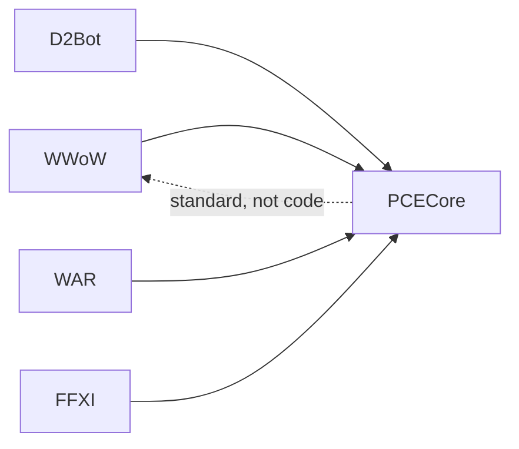
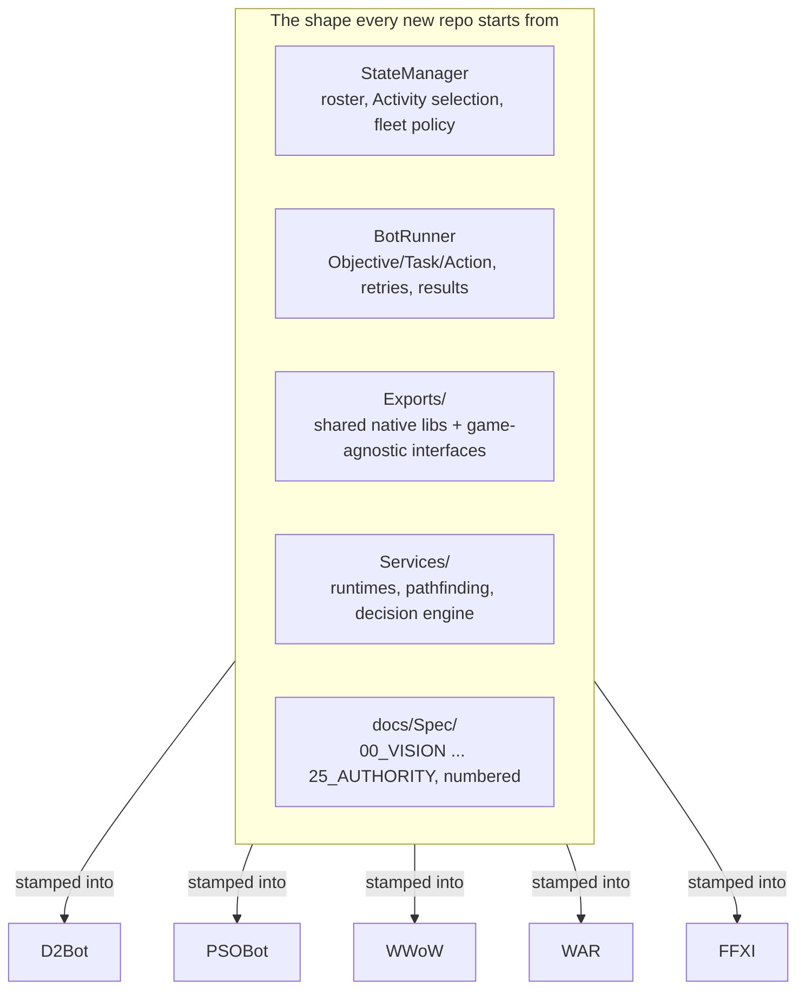

On March 23, 2026, four unrelated games got rewritten onto the same architecture on the same day.
WWoW was one of them. So were D2Bot, my old Diablo II project, a bot for Warhammer Online: Age of
Reckoning, and one for Final Fantasy XI. None of those other three had anything to do with WWoW's
codebase before that morning, and there was no shared repository for any of them to point at yet —
that came later. Four different games, four different network protocols, four different rendering
and memory layouts, and the same day on the calendar for all of them.

It's tempting to assume a shared standard like this one gets designed first and applied second:
someone sits down, draws the boxes, writes the spec, and then goes and implements it four times.
That is not what happened here, and I think the actual order matters more than the architecture
itself. WWoW, D2Bot, WAR, and FFXI were bootstrapped onto the AOTA layering and the
StateManager/BotRunner split in parallel, starting the same day, before there was any standalone
place to write the pattern down. The write-up came after the proof, not before it. PCECore, the
repository that now holds that standard, wasn't seeded as its own thing until May 19, 2026 — almost
two months later, once the pattern had already survived four separate codebases and I'd stopped
having to guess whether it would hold up outside WWoW.

## What PCECore actually is

I should be precise about this, because the name invites the wrong picture. PCECore is not a
library you add a package reference to and get a StateManager for free. It holds no game code and
builds no binaries. Open its commit history and most of what you find is a documentation and RFC
journal — cross-game reverse-engineering findings, decisions about where the MMO and session-based
categories diverge, notes on what worked in one game and didn't transfer to another. It's closer to
a shared constitution the other repos agree to than something you'd import. Each game repo
implements the pattern itself, in its own language and its own wire format, and PCECore is where the
argument about what the pattern should be gets settled and recorded.

There's a detail in there I like enough to just state plainly: PCECore's own docs now call WWoW its
"reference implementation and best-practice source." The project that needed the standard written
down for it ended up being the textbook example the standard points back to. Read that the wrong
way and it sounds like circular reasoning — WWoW proves the standard, and the standard is defined by
WWoW. Read it the right way, it's just an honest description of where the evidence actually came
from. WWoW has the deepest history against this architecture, so when PCECore needs an example of
"here is what the StateManager pattern looks like when it's been under real load for years," WWoW is
the thing to point at. Nobody sat down and decided that in advance.

## What ported cleanly, and why

The StateManager/BotRunner split carried over to every one of those games without changing shape.
Each one still has a StateManager deciding what a bot should be doing and a BotRunner carrying that
decision out, talking over the same protobuf-over-TCP transport, doing the same roster tracking and
heartbeats and typed start/replace/cancel messages. Only the wire schema changes — a D2Bot
ObjectiveMessage describes a Diablo II quest step instead of a WoW one, but the message itself, and
the reason it exists, is identical. That's not surprising once you say it out loud: the split is a
coordination pattern with no game-specific content in it. It doesn't know what a mob is or what a
navmesh is. It just knows that something needs to decide, and something else needs to do.

AOTA — Activity, Objective, Task, Action — ported even better than the transport did, and for a
similar but stronger reason: it's a decomposition principle, not a library call. A layering
discipline doesn't care what's underneath it. It expressed itself in a Diablo II quest tree exactly
as well as it expressed itself in a WoW dungeon, because "break the big thing into a sequence of
mid-sized things, and the mid-sized things into small ones you can actually implement and test" is
true regardless of which game you're pointing it at.

Put plainly, a new game repo doesn't start from a blank folder. It starts from a template, and the
template is the same regardless of which game is about to get bolted onto it:

What actually varies per game is almost entirely inside `Exports/` and `Services/` — the
game-specific memory layout, packet definitions, and pathing model. `StateManager`, `BotRunner`, and
the numbered doc tree under `docs/Spec/` show up with the same names and the same job on day one of
every repo, D2Bot included, which is the entire reason a scaffold takes a day instead of a quarter.

_The same dashboard concept as WWoW's StateManager UI, pointed at a completely different game — an
Activity, an Objective, a "why this objective" explanation, and a live signal feed, all describing
a Diablo II sorceress instead of a WoW character._

The clearest evidence for that is how fast D2Bot moved once the scaffolding was already sitting
there. From the day the AOTA rewrite started to a live boss kill was about three weeks. Compare that
to how long WWoW spent stuck on collision and physics before any of this architecture existed to
lean on, and the difference isn't subtle. Today D2Bot has one full quest working end to end — Act
1's "Den of Evil" — backed by more than 12,000 passing tests. None of that speed came from Diablo II
being an easier game to reverse-engineer than WoW; if anything, a randomly generated dungeon layout
per session is its own kind of hard. It came from not having to reinvent the shape of the solution
before starting on the game-specific part of it. The StateManager didn't need to be designed again.
The Activity/Objective/Task/Action layers didn't need to be argued about from scratch. All of that
was settled, and settled meant D2Bot could spend its first three weeks on Diablo II's actual memory
layout and packet structure instead of on architecture.

WAR and FFXI went through the same March 23 rewrite, and I'm not going to overstate where either one
sits today — neither has the kind of milestone D2Bot has, and this post isn't the place to claim
otherwise. What I can say is that both still run on the same StateManager/BotRunner split and the
same AOTA layering as everything else here, which is itself the point: the pattern didn't need a
fifth special case to accommodate them, even though I can't yet point at a live boss kill or a
farming loop to prove it out the way D2Bot and the PSO project can.

_WARBot running against a live target, the same account somewhere further along, and a third run
at an open-world objective fight. None of these is a milestone the way D2Bot's boss kill is —
that's the honest point being made above, not a gap in the screenshots._

_FFXI's rewrite from the same March 23 batch — one character finding its feet in Bastok Mines,
then three of them holding a party together in South Gustaberg. Same StateManager/BotRunner split
underneath both._

The Phantasy Star Online bot makes the same point from a different angle. It scored well on an
internal architecture-conformance checklist before a single line of actual gameplay code existed for
it, purely because it had inherited the doc scaffolding and the layering discipline on day one. Once
the actual reverse-engineering work for that game got done, it went from an empty scaffold to a live
two-bot farming loop in about six weeks.

_The PSO bot, six weeks after an empty scaffold — a live character in a live lobby, on the far side
of the reverse-engineering sprint the next section is about to argue no shared standard can shortcut._

## Where it didn't transfer

The honest part of this post is that "one universal architecture" is not what actually happened, and
the biggest counterexample is the foreground/background client split itself — the thing several of
the last several posts were entirely about. That split exists because WWoW has to account for an MMO
with thousands of potential concurrent bots, and running that many full game clients was never going
to work. Diablo II and PSO are session-instanced games with far smaller bot counts per session, and
when the same split got proposed for them, an internal review concluded it was the wrong call for
that shape of game: those bots should run in a single foreground-only process, full stop. No separate
background runtime, no PathfindingService, no SceneDataService at all.

That's the point where the "one standard, all games" pitch breaks, and it broke in a useful way — it
forced PCECore to grow a category system instead of staying one universal shape. Games are now MMO or
session-based/ARPG-style, and the standard says different things depending on which one applies:
an MMO-category game gets the full split, with a background runtime doing collision and pathing for
however many bots are actually online, plus the services that feed it world geometry; a session-based
game gets a single process per bot and none of that machinery. Pretending there was a single shape
that covered both would have been the less honest version of this post, and it also would have meant
D2Bot and the PSO project carrying around a PathfindingService and a SceneDataService that a review
already concluded they don't need — infrastructure with no job, just because the standard said
everyone gets one.

Pathfinding is the second clean example. WWoW's navmesh is static — baked once, describing a world
that doesn't change shape between sessions. Diablo II's dungeons are randomly generated every time
you play. A once-baked navmesh is a category error for that game; there's nothing to bake against
ahead of time. D2Bot needed its own navigation approach built from scratch, and none of the
Recast/Detour work from WWoW's side transferred at all.

## The part that never gets faster

Here's the actual conclusion, and it's a little deflating on purpose: per-game reverse engineering —
figuring out one specific game's memory layout, its network protocol, the shape of its objects in
memory — is entirely game-specific, and it gates everything downstream of it. The shared
architecture speeds up the harness and coordination work that sits around that reverse-engineering.
It does nothing for the reverse-engineering itself. There's no version of PCECore that tells you
where a Diablo II unit's health offset lives.

The evidence for this is sitting right next to the PSO success story. Several other game repos got
scaffolded on the exact same day as the PSO project — same doc structure, same conformance checklist,
same starting line. Months later, most of them are still sitting at that bare doc-conformance stage
with almost no implementation activity, because nobody has done the reverse-engineering sprint those
specific games need. Nothing about their scaffolding is broken. They pass the same checklist the PSO
bot passed. What they're missing is a person who sat down and spent weeks figuring out where that
particular game keeps its object list in memory, or how its packets are framed, and that's not a gap
a standard can paper over by being better written. The architecture lowers the floor: a working
scaffold shows up in a single day, every time, for any game you point it at. It never guaranteed a
ceiling. Whether a project actually gets anywhere still depends on someone doing the unglamorous,
game-specific work that no shared standard can do for them.

I don't think that's a knock against having built the thing. A shared architecture like this one is
worth building — it's the reason a brand-new game repo starts its life with a StateManager, a
BotRunner, and a doc-conformance checklist instead of a blank folder, and the reason D2Bot and the
PSO bot could skip straight past the arguments WWoW already had with itself. It makes the work you
still have to do per game go faster. It doesn't do that work for you.

