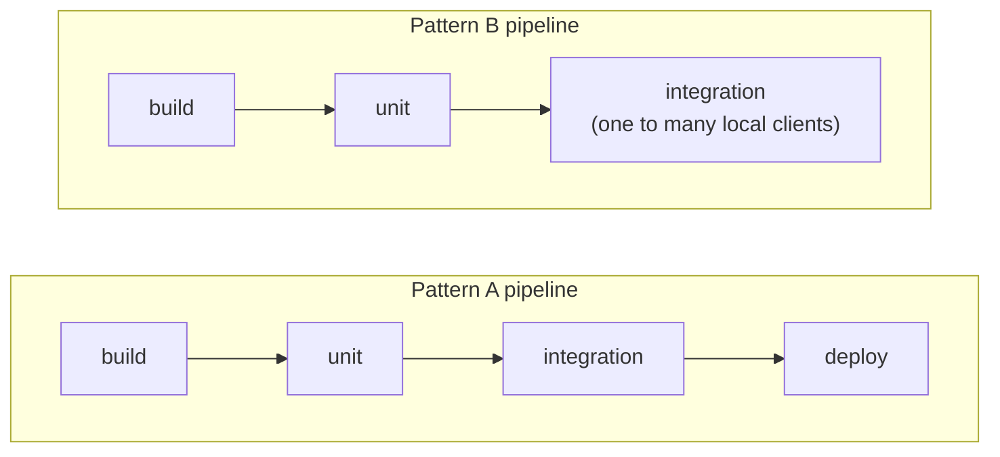
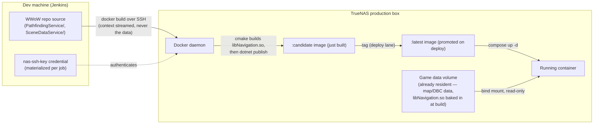
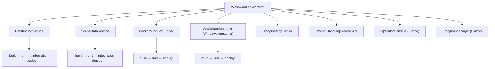
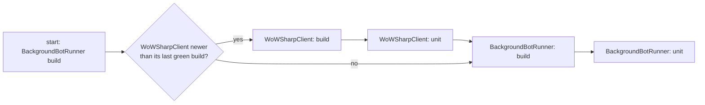

The old Jenkins setup was a flat list of jobs named things like `uo-pathfinding/build`. That's fine
right up until there are sixty of them across nine games and no view anywhere of which one depends
on which, or why a given game even has the jobs it has. The fix wasn't a better dashboard. It was
noticing that the jobs a game needs aren't arbitrary — they follow directly from one fact about
that game — and drawing the folder structure so it says that out loud instead of hiding it in
sixty job names.

## Two shapes of game

This is the MMO versus session-based split from "One Standard, Many Games," seen from the build
side, and it's a causal chain. A game whose population is dense enough that bots must keep acting
while nobody's watching needs a background runner; that runner needs SceneDataService for geometry
in zones it isn't rendering, and large static maps make PathfindingService worth precomputing once.
One fact about the game (scale) forces two services into existence.

Games that don't clear that bar skip both. If the map is randomly generated it's usually small
enough to query directly through the StateManager as a shared fog-of-war rather than precompute and
serve. Nothing has to stand and run all the time,
so there's nothing to deploy.



Right now that puts Ultima Online, Warhammer Online, Final Fantasy XI, WWoW, EverQuest, EverQuest
II, Ragnarok Online, Star Wars Galaxies, and Global Agenda all on the left — each with its own
`<game>-pathfinding` and `<game>-scenedata` pair running the full build/unit/integration/deploy
lane sequence. Diablo II and Phantasy Star Online sit on the right, with no such pair at all. A
repo moves from the right column to the left the day its scale actually forces a background
runner into existence — same template, new entries in the deployables list, nothing
architecturally new gets invented for the occasion. And Pattern B isn't thinner testing, just a
thinner deploy story: its integration lane still launches one to many real game clients on the
Jenkins host and lets them interact with each other and a shared StateManager, which is genuine
multi-client behavior coverage. It's just never packaged into an image or shipped anywhere,
because there's nothing standing that would need shipping to.

## How a service gets its data

Both services in a Pattern A pair go through the identical lane sequence — what differs, and what's
worth diagramming on its own, is the one extra step where each acquires the actual game data it
serves:



The mechanism is identical for both services: a `cmake` step compiles the shared C++ navigation
target into a `.so` inside the image, then `dotnet publish` builds the .NET service around it.
What never happens, and what the whole diagram is really arguing for, is game data crossing the
wire from the dev machine. Only source code makes that trip. The map and collision data were
already sitting on the production box before this pipeline ever touched it, and they stay there.

The pathfinding service is the richest case, because its mount point isn't one directory but four
landing side by side under it: precomputed navigation tiles baked by this fleet's own tooling, the
server emulator's own map and collision data, and the scene-tile data the scene-data service alone
reads. Each one binds from its own separate source directory, so rebaking navigation tiles never
touches the server's own data directory and vice versa — different owners, different update
schedules, one mount point the service reads from without needing to know which owner last
touched which file. Every Pattern A service follows the same underlying rule: the image itself
carries no game data at all, only the compiled service and whatever native library it needed built
alongside it. Everything data-shaped is already there, read-only, before the container so much as
starts.

## The view Jenkins actually renders

Each game gets a folder at the top level. Inside it, one folder per project, and inside that, only
the lanes that project actually needs — a pure library gets build and unit and stops there; a
deployable service gets the full build/unit/integration/deploy run; anything without tests yet
just gets build until tests exist to run.

WWoW is the widest repo in the fleet and shows that range in one place — two client-tethered
services, a background worker with its own image, a Windows-only service, an MCP server, and two
Blazor UIs, eight different project shapes, one folder each, the same template underneath every
single one:



Click the game, see its projects and how they connect. Click a project, see its lanes. Click a
lane, see its steps. It's the same drill-down a purpose-built pipeline-visualization tool would
give, built entirely out of nested folders instead of a separate plugin. WoWStateManager earns its
own footnote here: it builds from a Windows base image, not the Linux image everything else in the
fleet uses, so its build lane needs a Windows-capable agent while the rest of the tree runs on
Linux without anyone having to think about it.

Which lanes a project gets isn't a judgment call made folder by folder, either — it's a lookup on
what the project *is*:

| Project role | build | unit | integration | deploy | reset-db | rebake |
|---|---|---|---|---|---|---|
| Pure library | yes | yes | — | — | — | — |
| BotRunner / StateManager (compiles into the client) | yes | yes | if fixtures exist | — | — | — |
| Deployable service | yes | yes | yes | yes | if it owns a DB | — |
| Pathfinding rebake | yes | — | — | yes, to production | — | yes, full parameters |
| Game server (rarely touched) | yes | — | — | yes, to production | — | — |

A `deploy` lane always promotes an already-built candidate image to latest and rolls the compose
service — it never rebuilds anything itself. `reset-db` stays its own lane rather than folding into
deploy, on purpose, because wiping data and shipping code are different amounts of damage if
something goes wrong, and the existing rule around it — a reason has to be given, a backup happens
before the wipe — carries over unchanged.

## Builds that pull their own dependencies fresh

The piece that turns this from a folder-organized job list into something closer to an actual
dependency graph: every project gains a list of the other projects it depends on, by slug, and
starting any lane walks that list first.

```
def start_lane(project, lane):
    for dep in project.depends_on:            # topologically sorted at generation time
        if dep.source_changed_since(dep.last_green_build):
            start_lane(dep, "build")
            if lane.needs_tested_artifact:
                start_lane(dep, "unit")
    run(project, lane)
```

Four rules make that safe instead of chaotic. A dependency only counts as stale if its source tree
has actually changed since the commit its last green build recorded — the same test that would
invalidate a Docker layer cache, just promoted into something Jenkins shows you instead of a
silent rebuild you'd never see. The walk only ever runs upstream: changing a shared library doesn't
automatically rebuild everyone downstream of it, because that would cascade across the entire
fleet on every commit to anything foundational — only the reverse holds, where starting a build
pulls what it needs fresh first. The dependency graph gets resolved once, at generation time, not
at runtime, specifically so a cycle in it fails loudly while the jobs are being generated instead
of hanging a build later. And because every lane runs that same freshness check first, not just
`build`, triggering a service's integration lane directly still guarantees everything underneath it
got built fresh — there's nothing to remember to run first.



Two real cases in the fleet today show why the graph has to allow more than one consumer per
dependency, not just straight chains. The network layer that both bot runners talk through is
shared between the foreground and background runner, so a contract change that touches its client
stub forces both of them to rebuild, not just whichever one someone happened to be thinking about.
And the shared native navigation target compiles into both the pathfinding service and the
scene-data service by way of the same `cmake` step, so a change there reaches two deployable
services from one edge in the graph. Neither case is hypothetical, and the walk has to handle both
without caring how many downstream edges a given node happens to have.

Some of this is running today and some of it is still the design sitting on paper, and I'm
deliberately not drawing that line in this post — a status snapshot goes stale within a week of
writing it, and this chapter is about the shape of the thing, not a progress bar. The shape is
what's going to outlast whichever specific job happens to be green or red on the day you read this.
