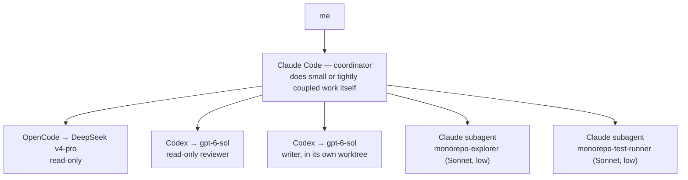

For the first two years of this project, understanding a piece of code meant grep, then read the
whole file, then grep again for whatever the first file pointed at, then read that one too. It
worked. It also meant that answering "what calls this, and what does it call" for anything
non-trivial cost several thousand tokens of file contents just to find the three lines that
actually mattered. That stopped being a minor inefficiency once there were eleven repos built on
the same shared patterns and a coding agent doing most of the reading.

The fix wasn't a smarter agent. It was giving the agent better tools than grep.

Every repo in the fleet has the same rough anatomy by now — `Exports/` for shared native code and
game-agnostic interfaces, `Services/` for the StateManager, the runtimes, and the rest, and a
numbered `docs/Spec/` tree that reads the same way in D2Bot as it does here. That template is its
own story, told in the "One Standard, Many Games" post. What matters for this one is that the tools
described below don't know or care which game repo they're pointed at. They operate on the shape,
not the content, which is exactly what lets the same three tools work across all eleven repos
instead of needing a bespoke one per game.

## A symbol graph instead of grep

The first tool is CodeGraph, and what it does is build a database of every symbol in a repo — every
class, method, and file — along with the edges between them, ahead of time, once, instead of
re-deriving that structure from scratch on every question. Ask it something like "how does the
StateManager reach the BotRunner's Objective queue" and it returns the relevant symbols' actual
source, the call path between them, and a blast-radius summary — the set of things that would break
if you changed the thing you're asking about — in one round trip. The index updates itself when
files change, so there's nothing to remember to re-run.

The difference in practice is the difference between a five-hop grep-and-read chain and a single
call:

```
# before
grep -r "SelectNextActivity" .
# → 6 files. Read each one to find the real caller.
grep -r "ActivityRuntimePump" .
# → 4 more files. Read those too.
# ...continue until the actual call path is reconstructed by hand.

# after
codegraph_explore("how does StateManager reach BotRunner's Objective queue")
# → the relevant symbols' source, the call path, the blast radius. One call.
```

Neither version is smarter than the other. The second one just doesn't spend tokens re-discovering
structure that was already sitting in a database.

## Compiler precision for the C# half

CodeGraph is good at "where is this and what talks to it" across a whole repo. It doesn't know
anything a compiler wouldn't also have to figure out — types, overloads, what's actually reachable
versus what merely shares a name. For that there's a second tool, built directly on the Roslyn
compiler APIs .NET itself uses, which means it answers with the same certainty a build would, not a
guess based on text matching.

The one that gets used constantly is reading a single member's body — one method, one property —
instead of opening a two-thousand-line file to find it. The others answer questions grep genuinely
cannot: true cross-project semantic references and callers, not string hits that happen to share a
name; the type hierarchy and shape of a file without reading it; and a diagnostics check that
verifies a file compiles clean, which is meaningfully faster than a full `dotnet build` when all you
need to know is "did that edit break anything obvious" rather than "produce me a binary." It doesn't
replace an actual build as the proof a change works — nothing here claims that — but it catches the
kind of mistake that would otherwise cost a full build cycle just to discover.

## The reverse-engineering server that stayed

"Decompile the Binary" and "The Cull" were both about a Python-then-Ghidra process run against
WoW.exe to recover its physics and movement code. What didn't make it into either post is that
Ghidra itself didn't go away once that job was done. It runs now as a standing server that any
session can call into directly — the same disassembly, cross-reference, and decompilation
operations that took a dedicated multi-day push in March are now a function call away for whatever
the next binary-shaped question turns out to be. The project stopped treating reverse engineering as
a one-time event and started treating it as a tool that's just always on, the same way CodeGraph and
the Roslyn tools are.

## A navmesh lab, twice

The reverse-engineering server wasn't the first standing tool built to stop guessing about
geometry. Before any of CodeGraph, Roslyn, or Ghidra MCP existed, the first purpose-built tool in
this whole toolchain was a small one: a matplotlib script that loaded a baked navmesh tile and
plotted it two ways — top-down, colored by WoW Z height, and as an elevation slice through X and Z,
colored by connected component.


_Two views of the same tile from the same tool. The elevation slice on the right is what actually
makes a lip-to-deck gap visible as a gap, instead of as two Z values that happen to be close
together on paper — this is the tool that first made the ground-surface-ambiguity problem from
"Two Wrong Models" something you could point at instead of just describe._

It answered exactly one question at a time and needed a fresh plot for every new one, which is
about what you'd expect from a script instead of an application. It's also the tool a coding agent
quietly made obsolete once it was pointed at building a real one. The Recast Demo — the "MMO Lab"
internally — is a proper 3D viewer built on the same Recast pipeline the actual bake uses: pick a
tile, toggle every world layer independently (terrain, WMOs, doodads, transports, off-mesh links,
the baked mesh itself), and for anything that moves, preview its route spline and probe a
start-to-end path directly against the baked geometry instead of reading coordinates off a
terminal.


_A moving transport is a good stress test for a navmesh-authoring tool precisely because it doesn't
sit still — a stop's position is only meaningful at one point along a spline, not as a fixed
coordinate, and the tool has to treat the route as data instead of scenery._


_And this is the point of building the lab in the first place — a bot actually standing where the
route data said it should be able to stand, instead of a plot confirming it after the fact._

## A coordinator, and workers it actually delegates to

The fourth piece isn't a code tool at all. It's how work gets split between a coordinating session
and a small number of other processes, and it's new enough that until recently it only existed as a
skill I might not even remember to open. It's part of how every repo works now, so it's worth
writing down properly instead of leaving it to be rediscovered by accident.



Each of those five branches has one job, and the job determines which one gets picked:

| Worker | Gets this work | Why it has this job |
|---|---|---|
| OpenCode → DeepSeek | Impact lists, "where is X," checking docs against source, across many repos | Cheapest option for bulk reading, and tied for the most precise reader in testing |
| Codex reviewer | A second look at a diff before risky work gets called done | A different model family than whatever wrote the change, which catches different blind spots |
| Codex writer | A second implementation attempt, or a cleanly separable piece of work | Runs in its own worktree so it can't collide with anything else in flight |
| monorepo-explorer | Quick lookups inside the current session | Keeps the coordinating session's own context small |
| monorepo-test-runner | Jenkins test runs and their summaries | Keeps raw build output out of the coordinating session's context |

The routing decision, stripped down to its actual shape:

```
def route(task):
    if task.is_bulk_readonly_across_many_repos():
        return delegate_to(opencode_deepseek)
    if task.is_review_before_risky_change():
        return delegate_to(codex_reviewer)
    if task.is_second_attempt() or task.is_cleanly_separable():
        return delegate_to(codex_writer, own_worktree=True)
    if task.is_quick_lookup_or_test_run():
        return delegate_to(claude_subagent)
    return do_it_myself()
```

A handful of rules hold the whole thing together, and they're rules rather than suggestions because
each one closes a specific way the system already went wrong once before it had them: a read-only
worker is blocked from writing anything, including through an editor tool that would otherwise let
it; exactly one writer is allowed per worktree; a task gets at most one repair round before it comes
back to the coordinator instead of looping; a worker can't spin up workers of its own, so the tree
never grows past one level; and every run's transcript lands in a folder the repo tracks in git,
so a delegated task leaves evidence behind instead of a result with no history.


_What the top box in that diagram actually looks like most of the time — an editor, an agent
terminal, and whichever game client is being tested against, all open at once, bug and all._

An earlier post — the one about deciding which coding agent gets which task — already covered the
least flattering and most important finding from actually using this: a coordinator handing work
to multiple workers on the same task measured over four times
slower than one agent doing the whole thing alone, for the same quality at the end. That's not a
reason this system doesn't exist. It's the reason it isn't the default — the five branches above get
used when a task specifically calls for cheap bulk reading, an independent second opinion, or a
separable piece of work, and the coordinator does everything else itself. The tree in the diagram is
real, but most tasks never leave the top box.

## What all four of these have in common

None of them make the coordinating session smarter. What they do is keep it from spending its own
limited attention re-deriving things a database, a compiler, a standing RE server, or a cheaper
process could have answered instead. CodeGraph and the Roslyn tools protect against re-reading code
that's already indexed. Ghidra staying up protects against re-running a multi-day investigation for
a question that only needs one answer. The coordinator-and-workers system protects against spending
the coordinator's own context on work that a cheaper or more independent process could have done
just as well. Different tools, same job: keep the expensive thing — judgment, applied to this
specific codebase — as the scarce resource it actually is.

None of this is finished, and I'd be surprised if the worker table above looks the same the next
time I write about it.
