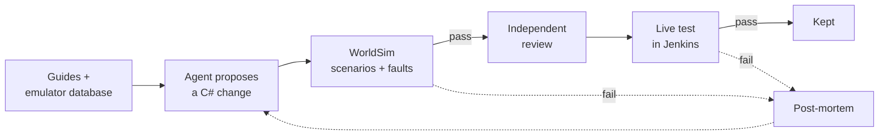

On October 5 I had an agent go back through the last thirty days of WWoW's history and sort every
commit by what it did. There were 522 of them. By a rough keyword sort, thirty-one added a feature. The
rest were repairs to earlier work, documentation and plan churn, a long run of commits splitting files
to get them under a line limit, and tests that mostly tested the shape of other code. The agent loop
behind a lot of it was steering by a task board that had since been deleted, and nobody, me included,
had noticed.

The repo was busy. It was not converging.

## What the sweep found

The numbers were all sitting in plain sight. The 300-line hard cap on source files, which seemed like
good hygiene when it went in, had produced 2,457 files under `Exports/` and `Services/`, a lot of them
holding a single member. The root `AGENTS.md` — the file every agent reads before it touches anything —
had grown to 645 lines with 56 hard rules. BotRunner's test project alone carried about 5,450 test
attributes, and a fair share of them pinned the shape of the source rather than what it did: tests that
failed because a file moved, because a hash of a fixture changed, or because a document no longer
contained a particular sentence. WorldSim, the frame-by-frame server simulation the rules called the
primary offline lane, wasn't in any Jenkins lane at all. The Jenkins job generators had been lost on
September 25, and the jobs that still existed built whatever happened to be in the working tree that
minute. And of the 153 Activities in the catalog, two could actually run.

None of it was hidden. It piled up the same way the 872 KB of raw disassembly did before "The Cull":
each piece made sense to whichever agent added it, and nothing was measuring the pile. The Cull was
supposed to be the lesson about exactly that, and I went and built a second pile.

The documentation that was supposed to keep the repos honest had drifted too. A week before the sweep,
a component-by-component comparison of three repos against the PCECore standard turned up two places
where the standard itself was wrong. It described SceneDataService as shipping a 3x3 grid of tiles —
and so did this blog, in "Shipping the World Without the Client," which now carries a correction. The
code actually works from the tile a bot is standing in, adds a neighbor only within 100 yards of that
edge, and holds on to anything inside a 5x5 neighborhood before letting it go. The standard
also listed line-of-sight as a call on the shared pathfinding wire, which is the exact pattern it exists
to forbid. Same finding as the Ghidra re-verification back in July: the implementation was right, and
the notes describing it were not.

## Eight layers

So the plan stopped being "fix what's broken" and became "assume all of it is." What done means got
pinned to four outcomes, all required: autonomous leveling, group content (dungeons, then raids),
movement parity between the two clients, and control of the fleet from the Operator Console. Every bot
repo gets the same eight layers to get there, built bottom-up, and every layer has a gate a machine can
check without anyone's opinion:

| Layer | Delivers | Gate |
|---|---|---|
| 0 · Foundation | CI rebuilt as code, one board, short rules | Every project builds in Jenkins from a clean checkout and publishes a test report |
| 1 · Servers and data | VMaNGOS built from source, versioned data and config | Build, deploy, rollback and snapshot-then-reset jobs each green once |
| 2 · Client contract | FG memory reader and BG packet client behind one object manager | FG-vs-BG parity tests on the same fields |
| 3 · Movement and physics | BG physics and pathfinding match the real client | Physics parity suite, pathfinding tests, live Travel and Zeppelin runs |
| 4 · Actions and Tasks | Move, interact, loot, rest, combat rotation | A WorldSim scenario per Task, plus a live check per Task family |
| 5 · Objectives and Activities | Runtime support for catalogued Activities | WorldSim plus a live test per Activity |
| 6 · Coordination | Parties and dungeons, Ragefire Chasm first | WorldSim Ragefire Chasm plus a live five-bot run |
| 7 · Autonomy and control | Hours of unattended leveling; fleet control from the console | Soak metrics — stuck seconds, deaths, progress per hour — inside limits |

The rule that makes the table mean anything is the boring one: work only happens on the lowest layer
whose gate is red. No exceptions for an interesting problem further up. A bot that can't trust its own
object manager has no business getting its pull timing tuned, and a lot of the repair commits in that
sweep were exactly that — fixes high in the stack for problems that lived further down.

On October 6 I took it one step further and reset every gate on every board to red, including layers
where every row was already marked done. A layer turns green again only when each of its rows' tests
passes again, in Jenkins, on the current code. Not in a local test run and not in an agent's summary.
"Done" on the old board had mostly meant somebody said so.

The repo got the same treatment around the code. `AGENTS.md` went from 645 lines to about 160. Twenty-one
plan files and most of `docs/` moved into an archive agents don't read by default. A single `BOARD.md`
holds every task, one row each, with a done column exact enough that an agent can check it without
interpreting anything. The 300-line cap became an 800-line warning that never fails a build. And the
test policy got written down instead of implied: live tests that drive a real Activity and WorldSim
scenarios are the acceptance gates; unit tests of pure logic and tests guarding a real wire or data
contract stay; source-shape checks, hash pins and tests that assert on documentation get deleted.

## No model in the loop

The bigger change is in what the bots are. The original pitch for Westworld of Warcraft was bots with
personalities, human enough that a real player couldn't tell, and one of the first things I did once a
background character could log in was pipe its chat into a local Ollama model and talk to it. On
September 27 the services that carried that idea — the prompt handling, a decision engine service, a
storyline server — were finished being deleted. Right now there is no model anywhere in the bots.

That came out of a research pass on how to actually make the bots smarter, and the evidence all
pointed the same way. Agents that ask a language model what to do on every decision pay seconds per
action. Live model-to-model coordination falls apart once each agent can only see part of the world;
that showed up in every benchmark I found, Collab-Overcooked and MINDcraft among them. The results
that held up — Voyager in Minecraft, BTGenBot on real robots — share one shape: a model writes behavior
offline, something checks it against the real thing, and only verified behavior is kept.

So the runtime is deterministic, and the intelligence moves to authoring time. Coding agents write
Activities, composers and Tasks as ordinary C#, the same way any other change gets written, and a
change reaches the bots only by going through this:

WorldSim admits a change; the live test decides. A green simulator run is not evidence a live run will
pass — WorldSim's own README says as much — and optimizing against a simulator alone drifts further from
reality the harder you push it. Every failure writes a post-mortem next to its Objective, and the next
attempt reads it first. The one place a scored policy is allowed to act at runtime is still the seam
from "AOTA: Decomposition and the ML Tiebreaker": when the composer has a genuine full tie, and only
then. The model writes the bot. It doesn't drive it.

The first pilot was one leveling-guide quest, Sarkoth, one of the first quests in Durotar, taken from guide
text to a live test with as few human edits as possible. It got as far as a reviewed branch with a
live test and a test-side decision trace before the October 6 reset archived it along with everything
else in flight. It's a row on layer 5 now, which is where it belongs.

Where all of this leaves the conversational half of the Westworld idea is an open question, and I'd
rather leave it open than pretend this answers it.

## The rest of the line

The split between the StateManager — the Orchestrator, as the code calls it now — and the BotRunner
got redrawn one more time, and this time harder. "The StateManager/BotRunner Contract" was about that
line moving. Now the Orchestrator picks Activities and nothing else. Coordination lives inside the
Activity: every bot in a party runs the same one, and roles and targets come from the Activity's inputs
and from what teammates report upward, never from the Orchestrator issuing commands. That's the opposite
of the 2024 design, where the StateManager's loop handed each bot its next task, and a guard test in the
unit lane fails if the Orchestrator ever reaches into an Activity's execution.

The other architecture decisions are short enough to be a list:

- A message is a full snapshot or a heartbeat. There is no delta protocol.
- Navmesh defects get fixed in the bake — one settings profile, full rebakes only — never by repairing
  routes at query time.
- 1.12.1 build 5875 is the only client. No multi-version abstractions until it reaches layer 7. The
  server and the client are both mine: a self-hosted VMaNGOS and a legacy client, nobody else's game.
- Packet layouts come from the server emulator's own source plus reverse engineering of the client, not
  from packet captures. "Escaping the Client" described foreground captures as the baseline the
  background client has to match; now the background client is checked against the server code that
  builds each packet, which covers branches a capture would never happen to hit.
- Adding a field or message to the protobuf contract is normal work. Renaming, removing or reframing
  anything needs me.

Every gate on WWoW's board is red as I write this. For once, the board and the code agree about where
things stand. Who is doing the climbing, and how that went in its first few days, is the next post.
