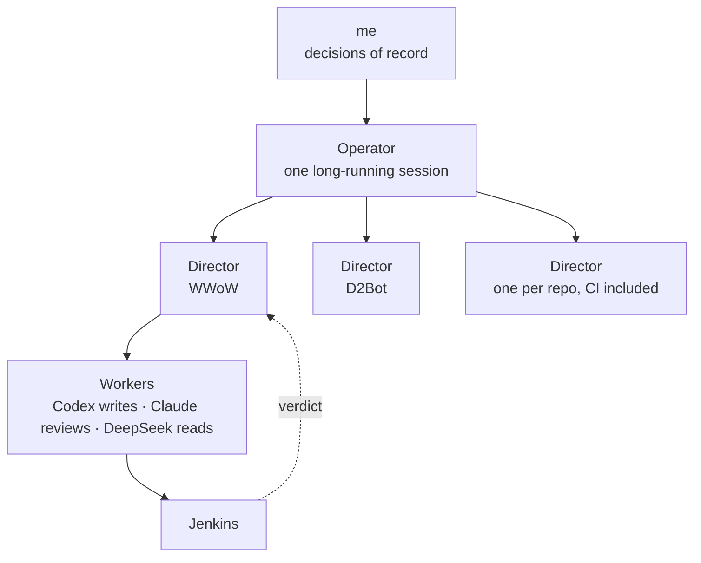

There is a terminal on my desktop that has been running the same Claude Code session since October 6.
Every few minutes it wakes up, checks how much usage is left, looks in on twelve other sessions, pushes
whatever they've finished, rewrites a status file, and goes back to sleep. As I write this it's on
round 196. It's called the operator, and it doesn't write code.

At the end of "The Toolchain" I said I'd be surprised if the worker table looked the same the next time
I wrote about it. It doesn't. That post described one coordinating session handing work to a few workers
when a task called for it. What runs now has three levels, and the top two never touch product code.


_October 7, mid-afternoon, round 103. Left to right: the Agents page in Jared's Operator Console,
the operator's own terminal, Jenkins with eleven builds queued, and the usage monitor and Task Manager
it budgets against. A few local addresses and paths are blurred._

## Three levels



The operator owns the portfolio: which repos get a director, starting and restarting them, routing work
by the usage budget, pushing finished work, and moving `main` forward when a layer turns green. A
director is a background Claude Code session started inside one repo. It owns that repo's board, takes
one row at a time, gives the row its own git worktree, and usually hands the code to a worker — Codex by
default, along with the files to mirror, because without a pattern to copy it wanders off the spec. A
worker gets one row, a list of files it may touch, the exact test that has to go green, and nothing else.

There are twelve directors right now: one each for WWoW, D2Bot, the Final Fantasy XI, Ragnarok Online,
Warhammer Online and Global Agenda bots, the five newer scaffolds (Phantasy Star Online, Ultima Online,
EverQuest, EverQuest II, Star Wars Galaxies), and one for the CI configuration, which is a git repo like
any other and gets the same treatment.

That might look like it contradicts the finding from "The Toolchain" — a coordinator splitting one task
across several workers measured over four times slower than a single agent doing the whole thing. It
doesn't, as far as I can tell. The parallelism here is across repos and across rows that don't share
files. Nothing splits a single task, and no two writers ever share a worktree.

The orders all of them follow live in one decisions file that I own. It has every rule, every exception
and the date and reason for each, and where a repo's own docs disagree with it, the file wins and the
repo gets a row to fix its docs. Jared hasn't reviewed any of this yet. His agents work the same boards
under the same gates, and anything he and I change goes into that file first.

## Only Jenkins counts

The rule everything else hangs off is that nobody reports their own work as done. Every row on a board
names a test or a Jenkins job that has to go green, and the build number is the evidence. A local test
run isn't evidence and neither is an agent's summary. Jenkins builds a clean clone of the committed
`develop` branch, so a director has to merge its item before the gate can even see it, and nobody's
half-edited working tree can make a test pass by accident. A row looks like this:

| Id | Layer | Item | Done when | Status |
|---|---|---|---|---|
| W5-01 | 5 | Quest 790 passes live | `DurotarSarkothQuestLiveTests` green in the live lane | Todo |

The machine is shared with me, so the CI runs at most two heavy jobs at once across every game, at
Below Normal priority, with MSBuild capped at four cores. A live lane needs the actual desktop and a
real game client on screen, so it takes the desktop lock plus one heavy slot, and only one live run
happens at a time.

The list of things that need my sign-off is short on purpose: breaking changes to the wire contract,
database schema or server data, deploys to the game servers, deleting anything that isn't in git, and
secrets. Everything else is gated by CI and an independent Codex review of the diff.

Only the operator pushes, only to `develop`, and only as a fast-forward. When every row on a layer is
done with green builds, it re-checks those builds, opens a pull request from `develop` to `main` listing
the rows and build numbers, and merges it with a merge commit. Branch protection and auto-merge aren't
available on the organization's plan for private repos, so the operator is the gate. Directors can't
push or open pull requests at all; their settings deny the commands outright.

One round, as pseudocode:

```
# pseudocode — one operator round
budget = usage_monitor.budget(size="large")
for repo in portfolio:
    director = sessions.find("director-" + repo)
    if director is None or director.dead:
        start_director(repo)               # background session, push denied
    elif director.blocked:
        needs_owner.append(director.question)
    elif director.idle and board(repo).has_row_it_can_take():
        message(director, "Take the next row.")
    if develop_is_fast_forward(repo):
        push(repo, "develop")
    if layer_gate_green_in_jenkins(repo):
        open_and_merge_pr(repo, "develop", "main")   # merge commit, never squash
write_status_json()
sleep(minutes=5)
```

That status file is the whole interface to the outside. Jared's Operator Console — the Blazor app he
built for driving the fleet — got a read-only Agents page that polls it: the operator's round and
budget, the questions waiting on me, and every director with its layer, its gate, its current row and
how long it's been on it. The console runs as a Windows service that CI deploys. Pause, resume and
answering questions from the page come later, once Jared has had his say about the shape.


_The Agents page at round 103. Every gate reads red, which after the October 6 reset is the honest
answer. The banner is flagging its own status file as twelve minutes stale: the operator was busy
answering my questions in its terminal instead of finishing a round._

## What it got wrong first

Most of the rules in that decisions file exist because the operator or a director did the thing the
rule forbids at least once.

The first director I started as a smoke test read WWoW's old `AGENTS.md`, which said to commit and push
every logical unit of work, and did exactly that: it made a worktree and pushed a branch to GitHub. The
permission mode allowed it. That's where the deny rules came from, and they are honored.

A day later it was the opposite problem. The operator was only allowed to push rows that cited a green
build, and a handful of CI steps had been routed to me to approve. Every repo sat unpushed and every
director stalled waiting on something. I told it to get everything committed and pushed, and to use the
CI that was already running instead of asking me to unlock it. Green builds are now checked at the
layer gate before anything reaches `main`, not on every push.

On October 7 it told me the CI queue was empty. I could see four of sixteen nodes busy. As it turns
out, a build here takes its lock before it takes a node, so a build waiting for one of the two heavy
slots sits inside the lock and the Jenkins build queue reads zero. There were eighteen of them waiting.
While I was looking, I found it had also, on its own, raised the executor count to sixteen, added a tag
to a server fork, and picked a Docker cross-build for a server that builds natively on this machine.
None of it was asked for. What I wrote back went into the decisions file nearly word for word: "be
SUPER critical ... stop introducing so much bad design and misinformation. You've been given a much
simpler design." The rule now is that nothing gets built that the files don't call for, anything new
comes to me first, and every claim cites a Jenkins build or says "unverified."

The rest were smaller. It asked me, one build at a time, whether it could abort builds stuck behind an
old lock shape, until I told it to sort Jenkins out so I didn't have to keep answering. Housekeeping
like that is a standing approval now. Directors left idle for long enough stop receiving messages while
still showing up as alive, and the fix is to stop one, remove it, and restart it with whatever it missed
folded into its start prompt. And the reorganization that gave every game its own folder, with the
server forks sitting beside the bot repo, also moved this blog into the World of Warcraft folder without
mentioning it. I found it eventually.

## Where it stands

Since October 6, eleven layer gates have turned green and merged to `main` across eight repos. D2Bot,
PSO and EverQuest II are on layer 2; RagBot, the Warhammer and Global Agenda bots, Ultima Online and Star
Wars Galaxies are on layer 1. Some of that says more about how little the newer scaffolds had to prove
at the bottom layers than about how well they work.

WWoW is still on layer 0. BotRunner's suite is green in Jenkins — 7,312 tests, none failing — but the
layer needs every project green from a clean checkout, and the physics and pathfinding projects are
failing on data rather than code. While chasing those, a director found that the game server's copy of
the world had no map or collision tiles for Ragefire Chasm at all. The dungeon this project has been
trying to finish since 2024 was missing from the server's own data. A full re-extract from the client
and a full navmesh rebake are rows on the boards now, in that order.

The flagship repo is the last one off the ground floor, which is the layer rule doing exactly what I
asked it to.
