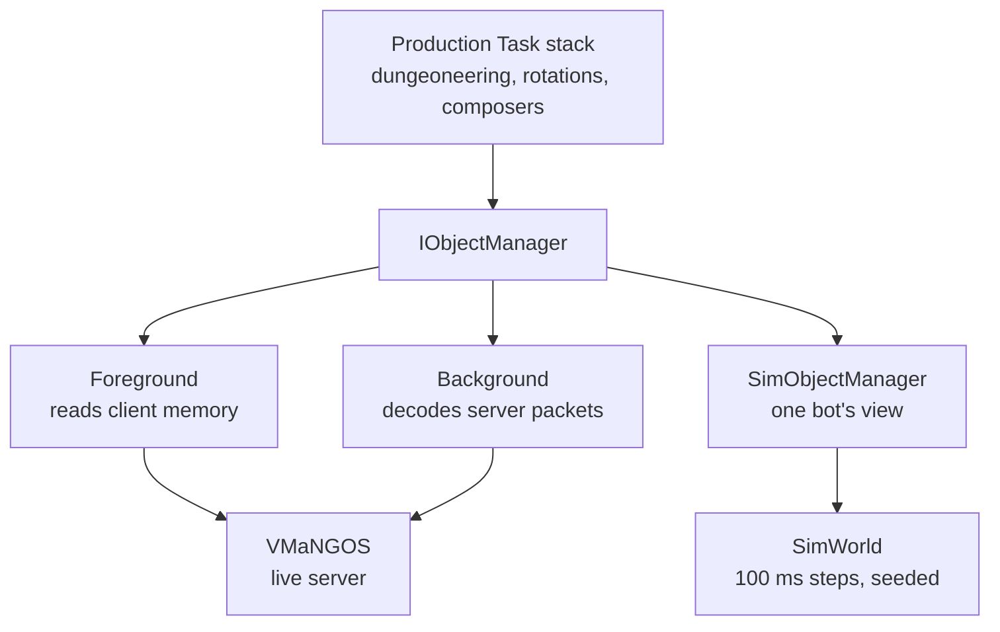

On October 7, the two largest of WWoW's offline simulation lanes ran with about 2,400 and 2,700 tests
in them, and each one failed exactly two. The same two. One of them stopped on a line that reads like
a combat log: a bot body-pulled Earthborer, the creature entered combat while unmarked, and the tank
was alive 20.5 yards away. The other reported an over-pull during a boss.

Nobody was in Ragefire Chasm when either of those happened. There was no server, no game client and no
login. Five copies of the real bot code ran against a simulated server inside a unit test, and the
simulated server caught them breaking the pull rules from "The Pull Problem." That simulated server is
WorldSim. "Ground Up" put it in the gates for three of the eight layers with one clause of explanation.

## Where it came from

The idea is older than this blog. When I wrote out the project's history for it, the idea was where I
stopped. By then I had the BotRunner logic and a lot of the background client under unit tests, live
runs went against a local server emulator, and every live run still meant booting at least one
foreground client and logging in so a person could watch. Near the end of that history I wrote "a
world-server unit test where we use server code behavior in our unit tests so it can emulate the
server world (or at least certain encounters) in a frame-by-frame basis so we can make sure the bots
perform exactly as requested."

There was already a mock server in the test folder: 284 lines, its own fake player types, game state in
a string-keyed dictionary and `Task.Delay` standing in for latency. Nothing used it, it drove no bot
code, and it couldn't give the same answer twice. In early August it was deleted the same day the real
thing was scaffolded, which is about as clean as a handoff gets around here.

The first milestone landed that night: the unmodified production `DungeoneeringTask`, on a real task
stack, ticked by the production driver, running against the simulated world. Five tests, green in
sixteen seconds. It took four tries, and each failure was a missing piece the simulator named itself:
no pathfinding client, no class container, a transport field the real client genuinely sees, and one
plain mistake in the test setup. Every one of them showed up as a named work item instead of a null
reference three frames later, and that property is most of what makes the thing worth having.

## A third object manager

Everything a bot knows about the world comes through one interface, `IObjectManager`. The foreground
client implements it by reading the game's memory, the background client by decoding the server's
packets. WorldSim is a third implementation, and that's the whole trick: the Task stack above it can't
tell which one it's talking to, so the code under test is the code that runs live. The README's rule is
blunt: anything in the simulator that decides what a bot should do is a bug, because a simulator that
re-implements the bot tests a copy and proves nothing.



Underneath there are two halves. `SimWorld` is the server: the authoritative record of every unit, its
health, threat list, auras and position. `SimObjectManager` is one bot's view of it, holding only what
that bot's 1.12.1 client would have learned from packets, and it never hands a server object to bot
code. Five bots get five views of one world, which reproduces the thing that makes group play hard in
the first place: nobody sees everything.

Time is a counter: each step is 100 ms of game time, and nothing in the simulator reads the system
clock. Randomness comes from seeded generators handed to every place that rolls dice.
`System.Random` is banned in the assembly, partly because .NET doesn't promise the same sequence across
runtime versions. The phase order inside a step is fixed and ported from the server — time, spells,
auras, movement, aggro, player swings, creatures, client updates — and it matters in ways you wouldn't
guess. Players swing before creatures within one server update, so when a swing is lethal, the order
decides whether the creature gets one more hit in on the tick it dies. The server also doesn't scan for
aggro every tick; a unit that moves gets checked at most about once a second. An early version scanned
on every 100 ms step, aggroed up to ten times faster than live, and made "walk past fast enough that it
never notices" impossible to reproduce.

A scenario report carries a hash of the world fixture it started from and a hash of its full event
trace, and the driver replays a case and requires both runs to hash the same. That buys precision
about change. In August, when creature run speeds went from a rounded 8.0 to the 8.00002 the database
actually implies, the comparison showed that exactly two of 37,121 trace events had moved, both
navigation details for the same Earthborer at tick 46, and only in the last decimal places.

Then there's the rule that makes the rest of it trustworthy. Every member of `IObjectManager` the
simulator doesn't model throws, by name:

```csharp
// WorldSim's object-manager base: an unmodeled member fails, and says why.
protected override NotSupportedException CreateUnsupportedMemberException(string member)
    => new($"WorldSim does not model IObjectManager.{member}. " +
           "Either the scenario needs it (implement it in SimObjectManager, ported from the " +
           "pinned vmangos source) or the task under test is reaching for state it should not.");
```

A simulator that quietly returns null for whatever it doesn't model reports green for exactly the
things it never tested. The PCECore rule written for it in mid-August calls that a "false-green
generator." The behavior itself is ported from the VMaNGOS source at one pinned commit, and the step
function is annotated phase by phase with the server file and line each piece came from. The
self-hosted VMaNGOS server the live tests run against is meant to follow the latest upstream (getting
it there is still an open row on layer 1), so the two will drift apart. The standing decision is to
re-port only when a live test shows a real difference.

## What it leaves out

The model covers what a fight is made of: threat and aggro, linked aggro for creatures that pull
together, combat state, party and raid rosters, spell cooldowns and mana, Vanilla melee formulas, a
slice of direct damage and healing, auras, and creature movement — patrols, wandering, chasing,
leashing home. The world itself is captured read-only from the server's database. For Ragefire Chasm
that's 132 creatures, nine of them on patrol routes and 75 that wander.

What it doesn't model is written down as plainly: loot tables, items, game objects, the quest
database, quest eligibility and rewards, creature AI scripts, and most of the spell system's harder
cases. Creatures cast spells in the sense that the cast bar runs; the effect is empty. There is no
terrain, no collision and no line of sight, and a bot walking to a point moves in a straight 3D line.
The first pathfinding stand-in routed through solid rock, and the commit that added it said so in
capital letters. Patrols now replay corners captured from the real pathfinding service, and any
assertion that depends on the shape of a route is reported as skipped by design, never green, until a
recorded result from the real bake backs it.

The loot gap is the one with consequences. The Ragefire scenario declares exactly one loot roll by
hand: linen cloth off Jergosh the Invoker, at its real 25 percent chance, with a seed picked so it
actually drops. That's enough for a test to watch a bot loot something. Quest and item facts have to
be declared by hand in each scenario (the Sarkoth quest has a hand-built WorldSim run like that), so
authoring quests from a guide stays gated on live runs, and the Sarkoth pilot from "Ground Up" is a
live test.

## Ragefire Chasm, seed 0

The flagship scenario is a five-bot run of Ragefire Chasm with a level 16 party: an Orc protection
warrior, an Orc enhancement shaman (naturally), a Tauren restoration druid, an Undead affliction warlock
and an Orc beast mastery hunter with its pet. Each bot runs the production runtime with the dungeoneering
Task at the root of its stack. Some of the early five-bot scenarios ran in under a second, against a
live equivalent of about half an hour; the full Ragefire run, with everything wired in, takes about two
minutes per test. The harness does the same thing on every pass:

```
# pseudocode: the Ragefire harness, one pass per 100 ms of game time
while ticks < 120_000:
    world.step()                  # the server phases, in order
    for bot in party:
        bot.step()                # production Task stack, own SimObjectManager
    check_guards()                # body pull, over-pull, idle stall, health floors
    if four bosses down and party recovered, once:
        replace_all_five_runtimes()   # must resume from the run ledger
    maybe_inject_death()          # once: during trash, or during a boss
    fail if 1_000 ticks pass with no observable progress
```

Two parts of that loop matter more than they look. Partway through, the test throws away all five bot
runtimes and starts new ones, which have to pick the run back up from their run ledgers rather than from anything they remember. And the injected death is the only scripted fault so far. One bot is
dropped to 1 health and the creature already hitting it has its swing timer reset, so the next hit is
real, and so is everything after it: threat cleanup, the kill notification, recovery. More faults get
built when a scenario needs them.

Variation comes from those faults and not from the seed, because only one seed is valid. The party's
starting state was reviewed and hash-pinned at seed 0, and the code refuses any other seed. Elsewhere
in the suite, the wandering creatures follow routes recorded from the real pathfinding service at
seed 0. Change the seed and the dice ask for routes the recording doesn't have, so the simulator
throws instead of making one up. The full Ragefire run doesn't even get that far: it holds the
wanderers in place. So a green Ragefire run today means green at seed 0. Making WorldSim
deterministic across seeds, so a scenario can't pass on the luck of one, is an open row on layer 4,
done when the suite passes for seeds 0 through 9 in one CI run.

The two failures from the top of this chapter are the trash and boss variants of that run. Both turned
up during the layer-0 cleanup in early October, both are real failures in the production pull logic,
and the row that owns them says in so many words to fix the bot, not the test. The everyday Bot Runner
job filters them out, since they take two minutes apiece and are red, so the 7,300-odd tests it reports
green don't include them.

## What a green run proves

A green WorldSim run is not evidence that a live run will pass. "Ground Up" said that much; the README
says why in the same paragraph. What has actually stopped bots deep in Ragefire Chasm, as far as the
project's history can tell, was slow progress through two dips in the navmesh far into the cave, and stale navmesh files promoted to the server. WorldSim models none of it, and with no terrain at all it
can't catch a fault that lives in the geometry or the navmesh. What a green run proves is narrower:
that one class of failure in the Task logic isn't there. The scenario driver's reports stamp
themselves with a fidelity label and a live-parity field whose value starts with the word "Unproven,"
so nobody quotes one as a live result by accident.

That narrowness is the job. On layers 4 through 6 the simulator is the cheap gate in front of the
expensive one: a scenario per Task with a live check per Task family, WorldSim plus a live test per
Activity, the Ragefire scenario plus a live five-bot run. It turns away a change that body-pulls in two
minutes of CPU instead of half an hour of live run, and a change that gets past it still has to win
live.

When the October 5 sweep looked, WorldSim wasn't in any Jenkins lane. Two days later its offline lanes
ran and met their minimum test counts, and that same day the lane machinery was deleted. The everyday
Bot Runner job runs most of WorldSim's tests now; the Ragefire run's tests are in no Jenkins job at the
moment. Past the seed row and the two red tests, there's no inventory yet of which Tasks lack a
scenario, and scenario fuzzing and a parity oracle to check the simulator against the real server are
still open. The live five-bot test that layer 6 pairs with the scenario doesn't exist yet. The
simulated half of that gate is written and failing; the live half hasn't been written.

The Earthborer pull is a layer-6 row, so it waits behind everything below it. When it does get fixed,
the fix goes green in the world made of numbers first, and then the real cave gets the final say.
